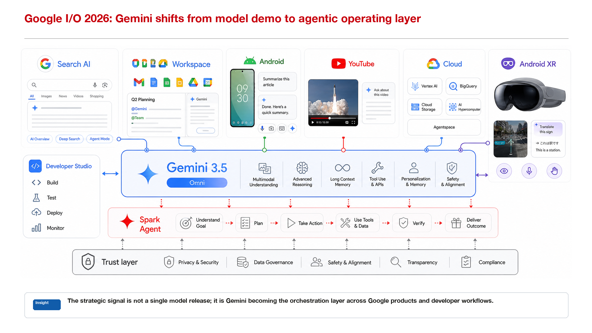
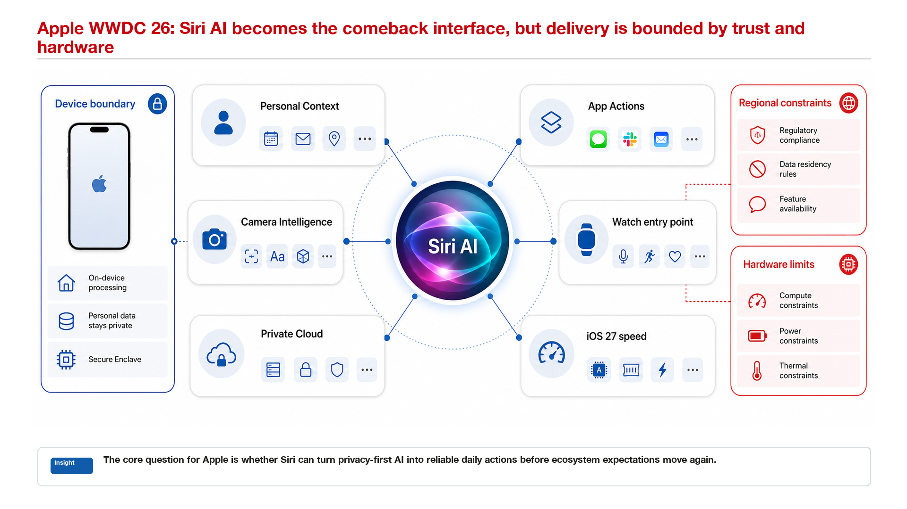

# Tech Company Report PPT Skill

`tech-company-report-ppt` is a Codex skill for building technology-company internal report decks: insight reports, technical analysis, competitive analysis, strategy reviews, and opportunity briefings.

Chinese documentation: [README_zh.md](README_zh.md)

## Purpose

The skill turns a short user topic into a structured PPT workflow for executive-style internal reports. Its default deck pattern is a fixed three-zone slide:

- Editable title at the top.
- Static `image2` middle canvas in a fixed wide panel.
- Editable bottom conclusion.

This keeps message-critical text editable while allowing the complex visual body to be produced with a high-quality image generator or a sourced image.

## Core Workflow

1. User provides only a topic or brief.
2. Codex creates `page-contracts.json` with slide roles, titles, core messages, key points, bottom conclusions, middle visual types, and evidence notes.
3. `scripts/init_three_zone_project.js` creates folders and writes one prompt per image page under `image2-prompts/slide-XX.md`.
4. `image2` generates the middle canvases into `image2-middle/slide-XX.png`.
5. `scripts/build_three_zone_deck.js` assembles the PPT with editable title text, a static middle image, and editable bottom conclusion text.
6. A contact sheet is exported for light QA.

Default output shape:

```text
<output-project>/
  page-contracts.json
  workflow-notes.md
  image2-prompts/
  image2-middle/
  preview/
  qa/
  final.pptx
```

## Capabilities

Beyond basic slide assembly, the skill guides the report structure and visual execution:

- Report structure: cover, agenda, overview, capability map, mechanism breakdown, evidence page, opportunity table, chapter synthesis, and final summary.
- Visual execution: restrained internal-report styling, compact grids, low-radius cards, thin dividers, and limited red emphasis.
- Middle-canvas prompting: reusable image2 patterns for architecture maps, dual-lane overviews, call chains, agent loops, opportunity tables, evidence cards, and synthesis pages.
- Content control: page contracts keep titles and bottom conclusions editable, while image2 receives only the middle-canvas brief.
- Lightweight QA: checks page count, editable title/conclusion text, middle-image existence, canvas fit, text errors, and contact sheet output.

## Three-Zone Page Contract

Standard content pages must follow this structure:

- Title: editable PPT text.
- Middle visual: static image in the reserved middle canvas.
- Bottom conclusion: editable PPT text.

The middle visual should be generated as middle content only, at about `2.37:1`, and must not duplicate the slide title, footer conclusion, page number, or other outer slide chrome.

## Visual Source Policy

`image2` is the preferred source for middle canvases. Official screenshots, user-supplied assets, or another image-generation tool may be used when they produce a useful middle visual.

If no image generation or useful source image is available, the workflow must explicitly mark `visual fallback`. Fallback output is a draft-only downgrade, not the default quality path.

## Failure Conditions

A deck is not acceptable if:

- A standard content page is built while its middle image is missing.
- A missing middle image silently becomes a placeholder PPT.
- The title or bottom conclusion is locked into a bitmap.
- The middle visual repeats the slide title or bottom conclusion.
- The middle visual includes a page number, placeholder text, lorem ipsum, or garbled text.
- The main visual is a script-drawn box diagram instead of image2 or a useful source image.
- The visual looks sparse, unstyled, or like low-quality generated PPT blocks.

By default, `scripts/build_three_zone_deck.js` fails when a middle image is missing. Only set `ALLOW_VISUAL_FALLBACK=1` for an explicitly downgraded draft.

## Showcase

Two approved examples show the default three-zone structure: editable title, static middle canvas, and editable bottom conclusion.





## Repository Contents

- `SKILL.md`: Codex skill instructions.
- `agents/openai.yaml`: Agent configuration.
- `references/`: Template, style, page-role, page-contract, prompt-library, middle-canvas, fallback, and light-QA rules.
- `examples/`: Minimal page contract and sample middle canvas.
- `scripts/`: Project initialization, deck assembly, and smoke test scripts.
- `docs/showcase/`: Approved showcase images used by this README.

## Smoke Test

Run:

```bash
node scripts/smoke_test_v1.js
```

The smoke test initializes a temporary skill project under `tmp-smoke/`, copies the sample middle canvas, and builds a test PPT. Remove `tmp-smoke/` after verification.
