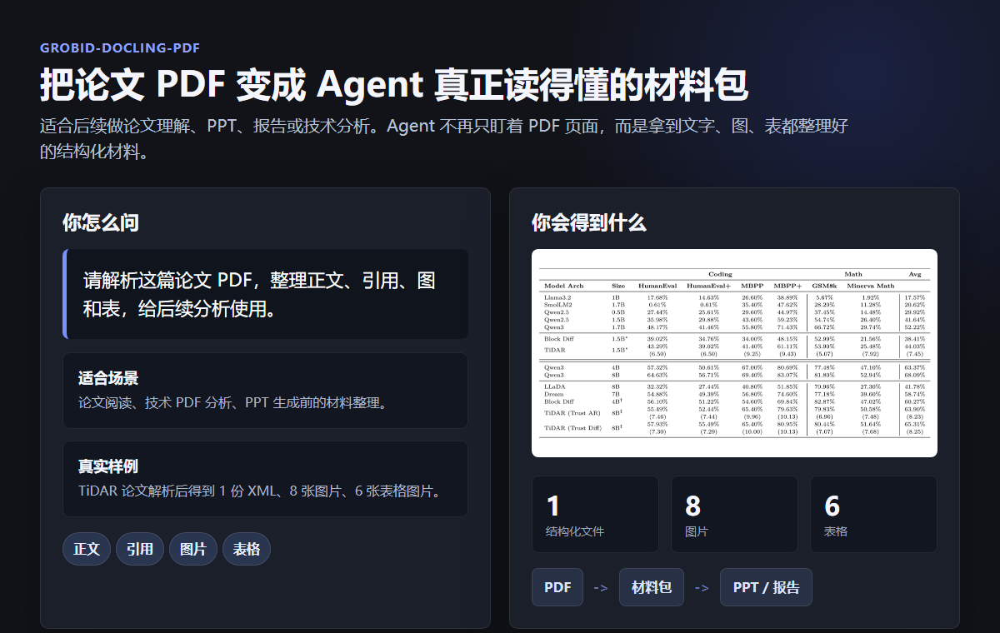

# 能力展示

`grobid-docling-pdf` 把论文或技术 PDF 转成结构化 XML、图表图片和可追溯解析包，让后续 Agent 能稳定做论文理解、PPT、报告或技术分析。

| 输入 | 输出 | 最关键效果 |
| --- | --- | --- |
| 论文 PDF、GROBID 服务地址、解析选项 | TEI/XML、图片/表格目录、中间结果归档、校验状态 | PDF 变成 Agent 可复用的材料包 |



这张图展示 TiDAR 论文解析后形成的结构化文件、图片与表格材料包。仓库中当前可打开的 TiDAR XML 示例索引了 7 张普通图片和 5 张表格图片；具体数量取决于输入 PDF 和 Docling 导出结果。

## 示例来源与可打开证据

示例输入来自论文 [TiDAR: Think in Diffusion, Talk in Autoregression（arXiv 摘要页）](https://arxiv.org/abs/2511.08923)，原始 PDF 由 [arXiv PDF 链接](https://arxiv.org/pdf/2511.08923)提供。

- [打开 TiDAR 表格图片样例（PNG）](https://raw.githubusercontent.com/MozhiJiawei/grobid_pdf_skill/main/docs/assets/tidar-table-sample.png)
- [打开 TiDAR 最终 XML（GitHub）](https://github.com/MozhiJiawei/hw-ppt-gen-html/blob/main/forward-tests/tidar-paper-deck/sources/tidar/final/tidar.xml)
- [打开材料包展示图（PNG）](https://raw.githubusercontent.com/MozhiJiawei/grobid_pdf_skill/main/docs/assets/pdf-xml-package-showcase.png)

这些链接只展示仓库中现有的示例证据。计数描述对应本次 TiDAR 示例，不代表所有 PDF 都会导出相同数量或质量的图片、表格和正文引用。

## 适合场景

- 论文 PDF 需要交给 Agent 做深度理解。
- 生成 PPT 前，需要先把正文、图和表整理清楚。
- 技术 PDF 需要保留章节、引用、参考文献和图表。
- 后续分析需要能追溯解析过程。

## 使用方式

你可以直接说：

```text
请解析这篇论文 PDF，整理正文、引用、图和表，给后续分析使用。
```

或者：

```text
请把这篇技术 PDF 变成 Agent 可以继续处理的结构化材料包。
```

## 处理过程

1. 读取 PDF 和解析配置。
2. 用 GROBID 抽取论文结构、正文、引用和参考文献。
3. 用 Docling 导出页面中的图片和表格。
4. 合并文本结构与图表索引。
5. 运行校验，确认材料包是否完整。

## 交付物

| 交付物 | 用途 |
| --- | --- |
| `final/*.xml` | 给 Agent 读取的结构化正文 |
| `final/images/` | 单独导出的图片和表格 |
| `*.intermediate_parse_results.zip` | 追溯中间解析过程 |
| 校验状态与摘要 | 命令输出会打印 `valid` 和各项计数，用于判断流水线是否成功 |
| `*.intermediate_parse_results.zip` 中的 validation JSON | 保留详细校验结果，供追溯；默认不会在 `final/` 中生成独立校验报告 |

## 展示覆盖

| Case | 输入 | 输出 | 证明的能力 |
| --- | --- | --- | --- |
| TiDAR 论文解析 | 论文 PDF | XML、图片、表格、归档包 | PDF 可稳定转成下游 Agent 材料 |

## 能力边界

- GROBID 服务是默认流水线的必需依赖；只完成本地包预检不能生成最终材料包。
- born-digital PDF 默认不开 OCR，扫描版需要显式启用 `--ocr`；OCR 或解析成功不等于内容逐字无误。
- 最终 XML 保证 Docling 导出的最终 PNG 被索引且引用路径可解析，但不保证每张图片都有准确的正文位置引用；应结合 `indexed_without_body_ref` 判断。
- 该 skill 不评价论文结论、不替代人工事实核验，也不承诺复杂公式、跨页表格或异常版式能被完美还原。
- 默认最终目录只包含 XML 和图片。校验摘要在命令输出中，详细校验 JSON 位于中间归档，不应把不存在的独立 `final/` 校验报告列为交付物。
