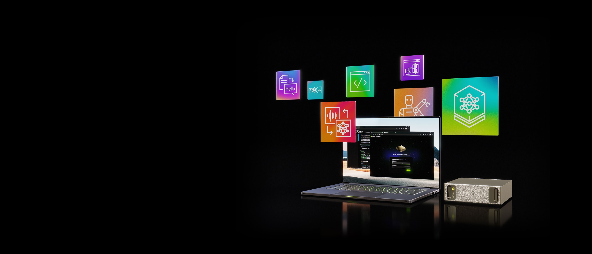
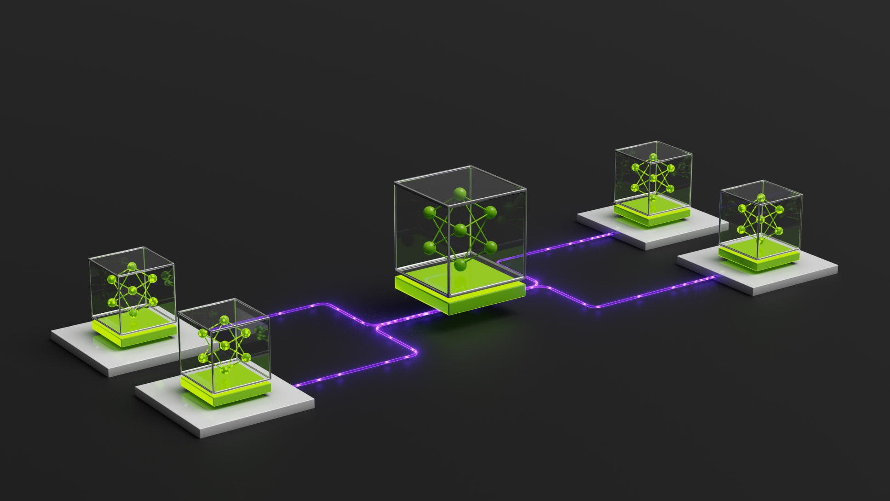
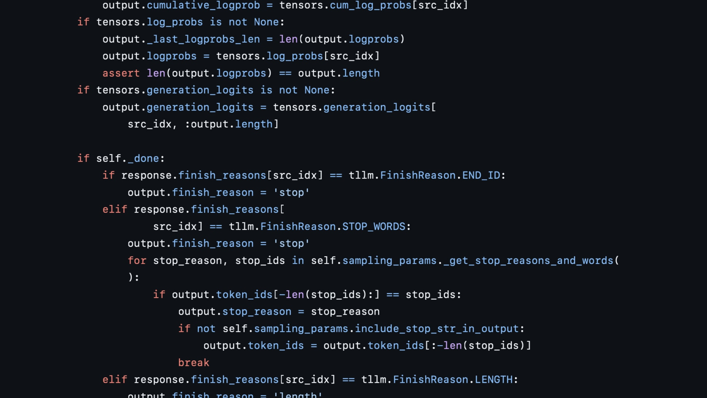
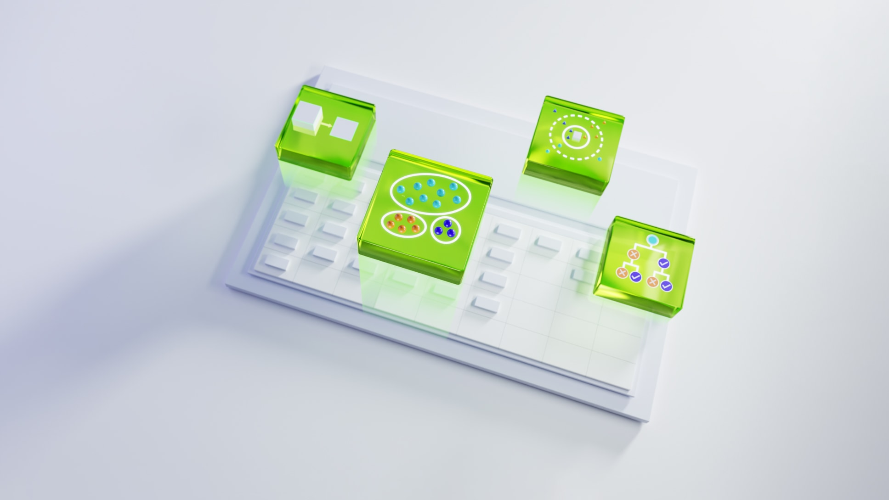
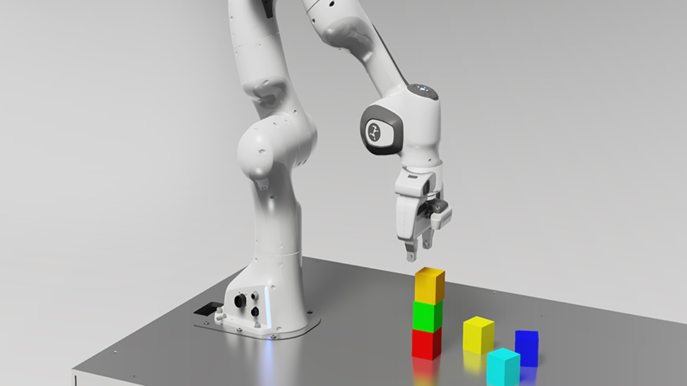
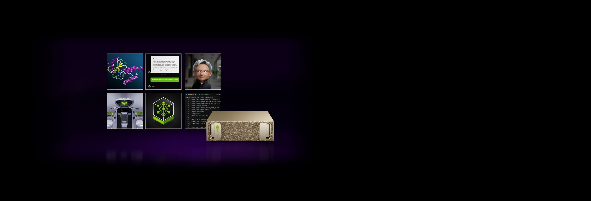
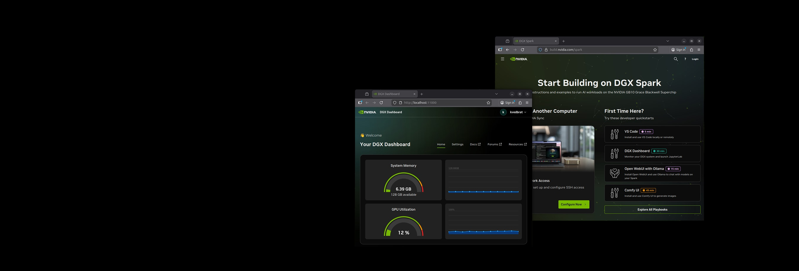

# NVIDIA DGX Spark / DGX Station for Windows

- Source URL: https://www.nvidia.com/en-us/products/workstations/dgx-spark/
- Official page title: Personal AI Supercomputer Powered by Blackwell | NVIDIA DGX Spark
- Requested title: NVIDIA DGX Spark / DGX Station for Windows
- Source slug: nvidia-dgx-spark
- Publisher: NVIDIA
- Captured date: 2026-07-07
- Capture mode: rendered capture with browser DOM extraction and original webpage image downloads
- Publication date / author: not stated on the captured product page

## Page Header

Original image URL: https://www.nvidia.com/content/dam/en-zz/Solutions/dgx-spark/DGX-Spark-bm-lg580-offset-left-l@2x.jpg

NVIDIA DGX Spark is presented as designed to build and run autonomous agents. The page points readers to NVIDIA Marketplace purchase options and support links including datasheet, specifications, and forum.

## Overview

### Desktop Agent Computer

Powered by the NVIDIA GB10 Grace Blackwell Superchip, NVIDIA DGX Spark is described as a complete platform for local autonomous agents. NVIDIA emphasizes large local memory, powerful AI compute, and the NVIDIA AI software stack as enabling agents and large models to run locally, reducing reliance on cloud-based token generation resources. The page positions DGX Spark as compact, power efficient, and built for always-on agent workloads from the desktop.

### Build Local AI Agents Faster with NVIDIA DGX Spark

A DGX OS update is described as adding streamlined NemoClaw installation, latest state-of-the-art open models, and up to 1.9x inference speedups to accelerate agentic AI development on DGX Spark.

Related link text on page: Read Blog.

### NVIDIA Announces NemoClaw for OpenClaw Community

NemoClaw is described as adding security and privacy to run secure, always-on AI assistants on NVIDIA RTX PCs, DGX Station, and DGX Spark.

Related link text on page: Read Press Release.

### Run Autonomous Agents More Safely

Original image URL: https://www.nvidia.com/content/dam/en-zz/Solutions/dgx-spark/NemoClaw-bm-md460-offset-right-l@2x.jpg

NVIDIA Agent Toolkit with NVIDIA OpenShell provides open source models and software for developers to build and deploy safer autonomous agents. NVIDIA NemoClaw is described as an open source reference stack that adds security and privacy guardrails to OpenClaw using OpenShell.

Related link text on page: Learn More About OpenShell.

### Playbooks and Getting Started

NVIDIA says curated DGX Spark playbooks provide step-by-step recipes for users from novice to expert. The page also lists getting-started resources: Quick Start Guide, User Manual, Unboxing Video, FAQ, and Support.

## Features

### NVIDIA GPU, CPU, Networking, and AI Software Technologies

Original image URL: https://www.nvidia.com/content/nvidiaGDC/us/en_US/products/workstations/dgx-spark/_jcr_content/root/responsivegrid/nv_container_1565518/nv_container/nv_teaser_1208631809.coreimg.svg/1781247645286/m48-gh200-ffffff.svg

#### NVIDIA GB10 Superchip

The page describes up to 1 petaFLOP of AI performance at FP4 precision with the NVIDIA Grace Blackwell architecture.

Original image URL: https://www.nvidia.com/content/nvidiaGDC/us/en_US/products/workstations/dgx-spark/_jcr_content/root/responsivegrid/nv_container_1565518/nv_container/nv_teaser_785216766.coreimg.svg/1781247645295/m48-ram-memory-ffffff.svg

#### 128 GB of Coherent Unified System Memory

NVIDIA says DGX Spark can run AI development and testing workloads with AI models up to 200 billion parameters at the desktop using large unified system memory.

Original image URL: https://www.nvidia.com/content/nvidiaGDC/us/en_US/products/workstations/dgx-spark/_jcr_content/root/responsivegrid/nv_container_1565518/nv_container/nv_teaser.coreimg.svg/1781247645305/m48-cx-7-chip-ffffff.svg

#### NVIDIA ConnectX Networking

High-performance NVIDIA ConnectX networking enables two NVIDIA DGX Spark systems to be connected to work with AI models of up to 405 billion parameters.

Original image URL: https://www.nvidia.com/content/nvidiaGDC/us/en_US/products/workstations/dgx-spark/_jcr_content/root/responsivegrid/nv_container_1565518/nv_container/nv_teaser_166247200.coreimg.svg/1781247645315/m48-nim-ffffff.svg

#### NVIDIA AI Software Stack

The page describes a full-stack solution for generative AI workloads, including NVIDIA tools, frameworks, libraries, and pre-trained models including NVIDIA NIM.

## Workloads

### Accelerate All Agentic AI Workloads

NVIDIA positions DGX Spark as delivering Grace Blackwell power in a desktop-friendly size for AI developers, researchers, and data scientists.

Original image URL: https://www.nvidia.com/content/dam/en-zz/Solutions/project-digits/nvidia-project-digits-prototyping-fg-i1of5-l.jpg

#### Prototyping

Develop, test, and validate AI models and applications. NVIDIA says DGX Spark provides a platform for developers to create, test, and validate AI models, build AI agents, build AI-augmented applications and solutions, and evaluate work for later migration to NVIDIA DGX cloud or other NVIDIA-accelerated data centers and cloud infrastructures.

Original image URL: https://www.nvidia.com/content/dam/en-zz/Solutions/project-digits/nvidia-project-digits-fine-tuning-fg-i2of5-l.jpg

#### Fine-Tuning

Fine-tune AI models up to 70 billion parameters. NVIDIA says 128 GB of unified system memory supports fine-tuning pre-trained models for specific needs and use cases.

Original image URL: https://www.nvidia.com/content/dam/en-zz/Solutions/project-digits/nvidia-project-digits-inference-fg-i3of5-l.jpg

#### Inference

Test, validate, and run inference with AI models up to 200 billion parameters. The page cites fifth-generation Tensor Cores with FP4 support, up to 1 petaFLOP of AI compute performance, and 128 GB of system memory.

Original image URL: https://www.nvidia.com/content/dam/en-zz/Solutions/dgx-spark/data-science-fg-i4of5-l.jpg

#### Data Science

NVIDIA describes high-performance data science at the desk, with 128 GB unified memory and 1 petaFLOP of parallel throughput for large, computationally complex data analytics and machine learning workflows.

Original image URL: https://www.nvidia.com/content/dam/en-zz/Solutions/project-digits/nvidia-project-digits-edge-applications-fg-i5of5-l.jpg

#### Edge Applications

DGX Spark is presented as a platform for developing edge applications with NVIDIA AI frameworks including Isaac, Metropolis, and Holoscan, supporting robotics, smart city, and computer vision solutions.

## Software

### NVIDIA AI Enterprise - DGX Spark

Original image URL: https://www.nvidia.com/content/dam/en-zz/Solutions/dgx-spark/enterprise-dgx-spak-bm-md460-offset-right-l@2x.jpg

NVIDIA AI Enterprise for DGX Spark is described as a cloud-native suite of software tools, libraries, and frameworks for production-grade AI development. The page highlights enterprise-grade security, optimized performance, and enterprise-level support to streamline prototype-to-production for next-generation agentic AI.

Related link text on page: Learn More; Get Started.

### DGX Spark AI Software

Original image URL: https://www.nvidia.com/content/dam/en-zz/Solutions/dgx-spark/dgx-spark-software-bm-md460-offset-left-l@2x.jpg

DGX Spark includes the NVIDIA AI software stack preinstalled with support for the NVIDIA AI software ecosystem so AI projects can get up and running quickly.

Related link text on page: Learn More.

## Resources

The page includes an Explore NVIDIA DGX Spark area with Blogs, Videos, and Community items.

### Blogs

- March 16, 2026: Scaling Autonomous AI Agents and Workloads with NVIDIA DGX Spark. Summary: learn why NVIDIA DGX Spark is an ideal desktop platform for autonomous AI.
- February 12, 2026: NVIDIA DGX Spark Powers Big Projects in Higher Education. Summary: the desktop supercomputer is sparking innovation across research fields, from campus labs to the South Pole.
- January 5, 2026: NVIDIA DGX Spark Gains 2x Performance and Open AI Model Support. Summary: the latest DGX Spark software release delivers performance uplift across models and workflows.
- October 13, 2025: NVIDIA DGX Spark Arrives for World's AI Developers. Summary: NVIDIA and partners are shipping DGX Spark, described as the world's smallest AI supercomputer, delivering NVIDIA's AI stack in a compact desktop form factor.

### Videos

- February 20, 2026: Meet the AI Photo Booth: DGX Spark + Reachy Mini at CES. Summary: at CES 2026, NVIDIA DGX Spark powers the Reachy Mini robot in an interactive photo booth with Pollen Robotics / Hugging Face.
- January 5, 2026: Build Your Own AI Assistant With Hugging Face on NVIDIA DGX Spark. Summary: NVIDIA and Hugging Face are bringing AI agents to life.
- October 15, 2025: Sparking Something Big: NVIDIA DGX Spark Has Arrived. Summary: behind the scenes delivery of NVIDIA DGX Sparks to developers, researchers, creative studios, and roboticists.
- NVIDIA DGX Spark Livestreams. Summary: live developer deep dives on the new NVIDIA DGX Spark desktop AI supercomputer.

### Community

- DGX Spark/GB10 User Forum: community support and inspiration for DGX Spark / GB10 users.
- NVIDIA Inception: go-to-market support, technical expertise, training, and funding opportunities for startups.

## Partners

The page includes partner sections:

- NVIDIA DGX Spark: get DGX Spark through authorized channel and retail partners.
- NVIDIA GB10 Superchip Powered Systems: discover NVIDIA GB10 Grace Blackwell Superchip-powered systems from preferred OEM partners.

Partner logos and footer navigation graphics were not retained as正文 support images.

## Captured Link Labels

Important link labels visible in the captured正文 flow include:

- Buy Now
- Datasheet
- Specifications
- Forum
- Read Blog
- Read Press Release
- Learn More About OpenShell
- Browse DGX Spark Playbooks
- Quick Start Guide
- User Manual
- Unboxing Video
- FAQ
- Support
- Learn More
- Get Started
- Watch Video
- See the Playlist
- Join the Developer Forum
- Apply to Inception

## Capture Notes

- Rendered page URL after navigation: https://www.nvidia.com/en-us/products/workstations/dgx-spark/
- Browser DOM snapshot API failed on this page with a browser-side compatibility error, so extraction used read-only page evaluation and rendered scrolling to load lazy assets.
- Main content boundary: started at the product H1 / hero and continued through Overview, Features, Workloads, Software, Resources, and Partners. Footer product/resource/company navigation was observed after the Partners section and excluded from the structured正文, except for noting that footer text appeared in the raw body tail.
- Kept media: 13 original webpage images tied to the product hero, safety-agent section, feature cards, workload cards, and software sections.
- Rejected media: cookie consent logos, footer/site chrome, partner/channel logos, and related-resource thumbnails. Related-resource thumbnails were visible but treated as secondary card media rather than required正文 evidence for this compact package.
