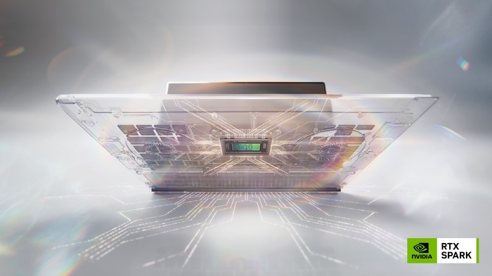

# NVIDIA and Microsoft Reinvent Windows PCs for the Age of Personal AI

- Source URL: https://nvidianews.nvidia.com/news/nvidia-microsoft-windows-pcs-agents-rtx-spark
- Title: NVIDIA and Microsoft Reinvent Windows PCs for the Age of Personal AI
- Publisher: NVIDIA Newsroom
- Published date: May 31, 2026
- Captured date: July 7, 2026
- Source slug: nvidia-news-rtx-spark
- Description: NVIDIA today unveiled NVIDIA RTX Spark(TM), a new superchip that reinvents Windows PCs for the era of personal AI agents -- offering a new class of computer that moves from tool to teammate.

## Subtitle

RTX Spark -- a 1-Petaflop Superchip, the Full CUDA and RTX Ecosystem, and Windows-Native Agents -- a New Beginning for Personal Computers

Original image URL: https://iprsoftwaremedia.com/219/files/202605/154ea89a7177c7d568f2f4916c7fd53a/6a1c9d873d6332761e1d64a8_nvidia-rtx-spark/nvidia-rtx-spark_mid.png

Caption / nearby text: Article hero image, alt text "NVIDIA and Microsoft Reinvent Windows PCs for the Age of Personal AI." The image also appears in the page's separate "More Images" module, which was excluded from the body capture.

## Article Text

**News Summary:**

- NVIDIA RTX Spark powers the world's first Windows PCs purpose-built for personal agents, featuring 1 petaflop of AI performance, industry-leading power efficiency, full-stack NVIDIA AI and graphics technology, and up to 128GB of unified memory.
- NVIDIA and Microsoft collaborate to deliver a native Windows experience for personal agents, including new security primitives and NVIDIA OpenShell to run agents securely on primary devices.
- RTX Spark lets creators, AI developers and gamers render ultralarge 90GB+ 3D scenes, edit 12K 4:2:2 video, generate 4K AI videos, run 120B-parameter LLMs with up to 1 million tokens context using agents locally, and play AAA games at 1440p and over 100 frames per second.
- Adobe is rearchitecting Photoshop and Premiere from the ground up for RTX Spark to deliver 2x faster AI and graphics performance.
- RTX Spark-powered slim Windows laptops with all-day battery life and premium displays, as well as compact desktop PCs available this fall from ASUS, Dell, HP, Lenovo, Microsoft Surface and MSI, with models from Acer and GIGABYTE to follow.

**NVIDIA GTC Taipei**--NVIDIA today unveiled NVIDIA RTX Spark(TM), a new superchip that reinvents Windows PCs for the era of personal AI agents -- offering a new class of computer that moves from tool to teammate.

Designed for AI, creating and gaming, RTX Spark brings together 30 years of NVIDIA innovation -- including NVIDIA CUDA(R), NVIDIA RTX(TM), DLSS, FP4, NVIDIA TensorRT(TM), NVIDIA OptiX(TM), Reflex and G-SYNC(R) -- to slim Windows laptops with all-day battery life and small, ultraefficient desktop PCs.

"The PC is being reinvented," said Jensen Huang, founder and CEO of NVIDIA. "For forty years, you launched apps. Click. Type. With RTX Spark and Microsoft Windows, you ask -- and the PC does the work. RTX Spark brings everything NVIDIA has built -- CUDA, RTX, our AI platform -- into a single superchip. Local agents. Frontier models. Creative workflows. RTX games. All on a laptop. This is the new PC. The personal AI computer."

The RTX Spark superchip features an [NVIDIA Blackwell RTX GPU](https://www.nvidia.com/en-us/data-center/technologies/blackwell-architecture/) with 6,144 CUDA cores and fifth-generation [Tensor Cores](https://www.nvidia.com/en-us/data-center/tensor-cores/) with FP4 precision, connected via the [NVIDIA NVLink(R)-C2C](https://www.nvidia.com/en-us/data-center/nvlink-c2c/) chip-to-chip interconnect to a high-performance, 20-core NVIDIA Grace(TM) CPU.

MediaTek, a market leader in Arm-based system-on-a-chip designs, collaborated with NVIDIA on the custom CPU design, contributing to its best-in-class power efficiency, performance and connectivity.

**Purpose-Built for Personal Agents**

AI agents have reached an inflection point, with open source projects such as OpenClaw and Hermes Agent achieving record-breaking numbers on developer networks like GitHub and OpenRouter. Yet broad adoption has been limited by the inability to run agents securely and privately on users' primary PCs.

NVIDIA and Microsoft are partnering to address this challenge by delivering a robust, secure Windows platform for on-device agents.

The collaboration begins with a strong foundation -- new Windows security primitives and the [NVIDIA OpenShell](https://build.nvidia.com/openshell)(TM) runtime -- to ensure agents run safely and under full user control.

The new Windows primitives deliver identity, containment, policy and end-to-end security capabilities to build and run agents natively. NVIDIA OpenShell provides additional policy capabilities for the user to define what agents can and cannot do, the ability to intelligently route queries to local models based on the user's privacy policies, and the ability to disguise personal information in queries sent to cloud models.

This robust security and privacy layer is being adopted by leading agent developers such as Hermes Agent and OpenClaw in their new Windows apps. These new apps will make it easy and secure for users to access powerful on-device agents that can execute tasks in Windows applications, reason through cross-app workflows, generate images and video, code plug-ins and apps, and semantically search local files.

"We are strong supporters of deploying agents like OpenClaw securely into the Windows ecosystem," said Vincent Koc, chief architect at the OpenClaw Foundation. "Running solutions like OpenShell and the Microsoft security primitives on RTX Spark will enable users to leverage a fully integrated stack for private, personal agents running on device."

Powering agents on local devices requires both robust security and performant hardware. RTX Spark features up to 1 petaflop of AI compute and 128GB of unified memory to meet the processing demands of on-device agents.

"At Nous, we expect tasks to increasingly run on device as personal agents like our Hermes Agent become more capable and ubiquitous," said Dillon Rolnick, CEO of Nous Research. "RTX Spark and NVIDIA OpenShell give Hermes users a powerful and secure environment for agents to run and work alongside you. You realize you're buying a full-fledged assistant, not a typical laptop."

From this foundation, [NVIDIA and Microsoft's collaboration](https://blogs.windows.com/windowsexperience/?p=180355) will expand to new RTX Spark-powered Windows agent experiences accessible from the Windows taskbar user interface.

"Our goal is to deliver unmetered intelligence to every home and every desk with Windows," said Satya Nadella, chairman and CEO of Microsoft. "RTX Spark marks a real breakthrough towards that vision."

**Full-Stack RTX Creating and Gaming**

RTX Spark delivers the full NVIDIA AI and graphics technology stack to creators, AI developers and gamers.

Users can render ultralarge 90GB 3D scenes with OptiX and DLSS, edit 12K 4:2:2 video with the NVIDIA Blackwell decoder, run 120-billion-parameter large language models with 1 million tokens context, and play AAA games at 1440p resolution and over 100 frames per second with ray tracing, DLSS and Reflex.

In addition to support for existing technologies, RTX Spark will power new RTX capabilities, including DLSS 4.5 Ray Reconstruction featuring a second-generation transformer model -- coming to Blender 5.3 and dozens of games -- and RTX Video with 4x Frame Generation, coming to ComfyUI.

RTX technology boosts performance, enhances image quality and adds powerful AI features in over 1,000 games and applications. Over 100 Windows software providers such as Adobe, Blackmagic Design, Blender, CapCut, ComfyUI and OTOY, and game developers such as KRAFTON, NetEase, Remedy Entertainment, Riot Games and XBOX are embracing the new RTX Spark platform.

- "Blackmagic Design and NVIDIA have accelerated video production for many years," said Grant Petty, CEO of Blackmagic Design. "Portable, lightweight RTX Spark laptops with fantastic battery life are going to help our customers take the next leap in on-the-go production."
- "Rendering is entering a new era where path tracing, AI and real-time workflows are converging into powerful new neural media artist tools," said Jules Urbach, CEO of OTOY. "Our work with NVIDIA to bring OTOY Octane with Render Network support to RTX Spark will deliver a new class of portable systems for creators."
- "The combination of RTX Spark's processing capabilities and large unified memory will make it one of the best-performing laptops to run diffusion models," said Yannik Marek, cofounder and creator of ComfyUI. "ComfyUI users can now run highly complex, multimodal workflows and generate ultra-high-resolution images and videos with unprecedented speed on a portable device."
- "RTX Spark laptops change the game by multiplying the amount of context processing and putting it directly into a beautiful, portable chassis," said Georgi Gerganov, founder of llama.cpp. "Highly optimized models running locally through llama.cpp with RTX Spark's AI performance will unleash the next wave of personal, private agents."
- "We worked closely with NVIDIA to support a great gaming experience and are excited to expand access to XBOX on RTX Spark devices, making it easy for players to discover and play with XBOX on PC," said Jason Ronald, vice president of Next Generation at XBOX.
- "RTX Spark allows even more gamers to experience NetEase titles like 'NARAKA: BLADEPOINT' on ultrathin, high-performance laptops the way the developers intended," said Long Cheng, senior vice president of Thunderfire BU at NetEase.
- "Remedy is looking forward to bringing its games together with NVIDIA to these stunning new RTX Spark laptops," said Mika Vehkala, chief technology officer of Remedy Entertainment.

**Delivering Powerful Creative Experiences**

NVIDIA is partnering with Adobe to rearchitect Adobe Premiere and Photoshop for RTX Spark. Firefly-powered Generative Fill in Photoshop and Generative Extend in Premiere are among the hundreds of accelerated tools that deliver creative power, precision and control. RTX Spark takes these capabilities further, delivering up to 2x faster AI, editing, coloring and effects across creative workflows.

"The best creative work in the world happens in Adobe tools from Adobe Firefly to Photoshop and Premiere, and the expansion of our partnership with NVIDIA and Microsoft will make those experiences faster and more powerful than ever," said Shantanu Narayen, chair and CEO of Adobe. "Together, we are building AI-native creative experiences for RTX Spark that deliver the performance, intelligence and responsiveness people need to create at the pace of their ambition."

Adobe Premiere will feature a new video pipeline that taps into RTX Spark's unified memory, Blackwell GPU and TensorRT software, delivering real-time performance for editing and color correction, GPU-accelerated AI performance and more efficient rendering of complex timelines. In addition, Adobe's Substance 3D Painter and Stager will run natively on RTX Spark for smoother and more responsive 3D texturing and scene creation workflows.

Adobe's next-generation Photoshop engine will be optimized for GPU-accelerated compositing, enabling live filters, high dynamic range and modern natural brushing. The AI-native pipeline is built to harness the full power of RTX Spark, including TensorRT.

Adobe will further extend Premiere and Photoshop to allow users to create, edit and design with Windows agents, providing creators with a collaborative teammate to accelerate their workflows.

Updates to Adobe's creative apps like Premiere, Photoshop and Substance are expected to start rolling out alongside RTX Spark availability.

**Premium Designs in All Sizes**

Engineered to be as slim as 14 millimeters and as light as three pounds, RTX Spark laptops will be available in 14- to 16-inch sizes and feature precision-machined aluminum chassis that blends durability with a clean, modern design. Color-accurate tandem OLED displays with NVIDIA G-SYNC technology provide stunning visuals for creative work and immersive gaming.

Small, ultraefficient RTX Spark desktops are built for agents, creative workloads, gaming and everyday productivity. Major hardware makers are rallying around RTX Spark, with many designs already in development.

- "The next generation of PCs must be powerful, intelligent, mobile and beautifully designed," said Jonney Shih, chairman of ASUS. "With RTX Spark, ASUS has the platform to build systems that define the future of personal computing."
- "Creators shouldn't have to choose between portability and performance," said Michael Dell, chairman and CEO of Dell Technologies. "With RTX Spark, Dell is delivering RTX performance and massive unified memory in the XPS 16 Creator Edition, a laptop built for people who demand the most from their hardware."
- "Developers and creators demand uncompromising performance wherever they work in the agentic AI era," said Bruce Broussard, interim CEO of HP Inc. "Our upcoming HP OmniBooks powered by NVIDIA will be one of the thinnest RTX Spark laptops, combining NVIDIA's RTX performance, the breadth of the Windows ecosystem and the efficiency of unified memory to deliver unprecedented portable power for agentic developers."
- "The NVIDIA RTX Spark represents an exciting leap forward for AI-native computing," said Yuanqing Yang, chairman and CEO of Lenovo. "Our long-standing partnership with NVIDIA continues to turn breakthrough innovation into real-world impact. With Lenovo's engineering and design expertise, global scale and comprehensive AI device portfolio, we are delivering a whole new level of AI experiences to creators, gamers and AI developers together, offering more choices to customers to build smarter AI for all."
- "For users who want AI acceleration, advanced content creation and strong gaming performance in a single device, RTX Spark is a compelling new platform," said Jeans Huang, CEO of MSI. "It has enabled MSI to redefine what a compact, efficient PC can deliver."
- "Surface has always exemplified the best of what a Windows PC can be. With Surface Laptop Ultra, we're bringing that focus to creators, developers and engineers who need serious performance in a device that is thoughtfully designed, portable and deeply connected to the Windows tools and platform they count on," said Brett Ostrum, corporate vice president of Surface at Microsoft. "Our work with NVIDIA will deliver a Surface built for the way ambitious work gets done."

NVIDIA and Microsoft's collaboration to deliver agents in the Windows experience extends from personal to frontier agents with [NVIDIA DGX Station(TM) for Windows](https://nvidianews.nvidia.com/news/nvidia-rtx-station-with-windows-puts-a-trillion-parameter-ai-supercomputer-on-every-enterprise-desk) -- scaling the Blackwell architecture to enterprise developers by putting an AI supercomputer for running agents deskside.

**Availability**

RTX Spark laptops and compact desktops will be available this fall from leading manufacturers including ASUS, Dell, HP, Lenovo, Microsoft Surface and MSI, with models from Acer and GIGABYTE to follow.

Tune in to the keynote at Microsoft Build, running June 2-3, to learn more about Windows agent capabilities for developers, including new Windows security and containment primitives and NVIDIA OpenShell.

*Watch Huang's* [*keynote*](https://www.nvidia.com/en-tw/gtc/taipei/keynote/) *and learn more at* [*NVIDIA GTC Taipei*](https://www.nvidia.com/en-tw/gtc/taipei/)*.*

## Media Contacts

Kelly Musgrave  
Consumer PR  
NVIDIA Corporation  
press@nvidia.com

## Capture Notes

- Capture mode: rendered capture via Codex in-app Browser.
- Browser recovery: first navigation attempt timed out during `Page.navigate`; a fresh-tab retry reached `domcontentloaded` successfully.
- Body boundary: extracted from the rendered `.main-content .article` container. The正文 text came from `.article-body`; capture stopped after the final keynote / NVIDIA GTC Taipei links.
- Tail audit: `Downloads`, `More Images`, `More News`, cookie banner assets, global navigation images, and related-news thumbnails were outside the正文 flow and excluded.
- Media summary: kept 1 article hero image. The page contained no additional inline正文 figures inside `.article-body`. The same NVIDIA RTX Spark image also appeared in the non正文 "More Images" sidebar and was not duplicated.
- Image acquisition: the page's rendered image asset `nvidia-rtx-spark_mid.png` was exported through the browser page-assets inventory. A higher-resolution linked asset was visible at `https://iprsoftwaremedia.com/219/files/202605/154ea89a7177c7d568f2f4916c7fd53a/nvidia-rtx-spark.png`, but direct download timed out during capture, so the rendered original webpage image asset was used.
