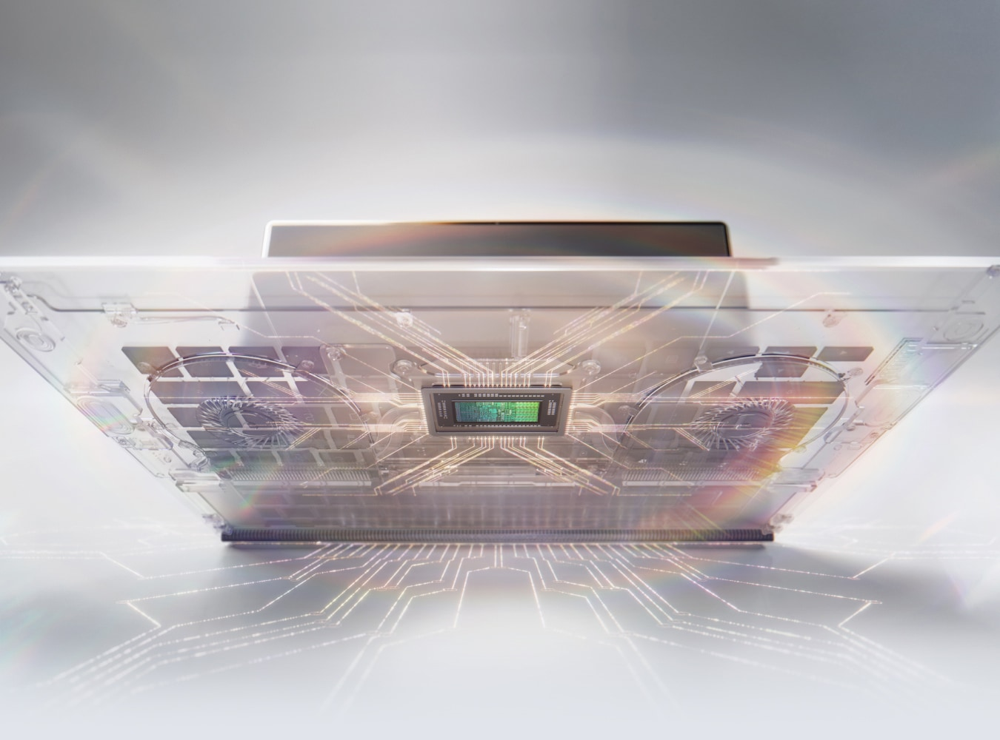
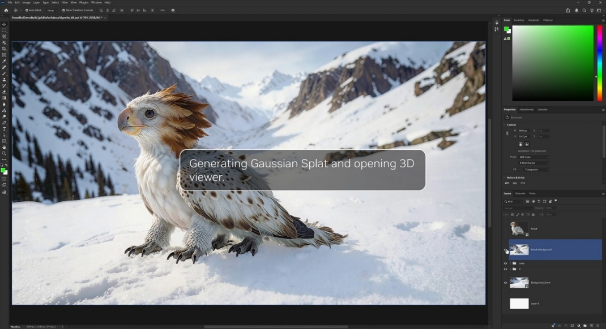
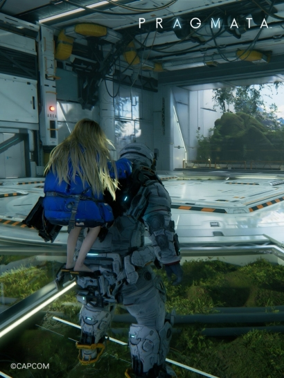
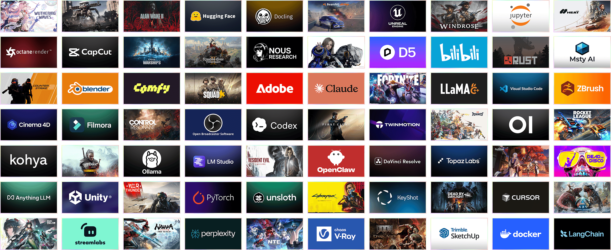
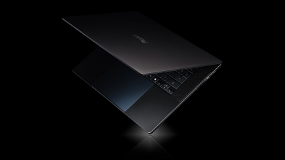
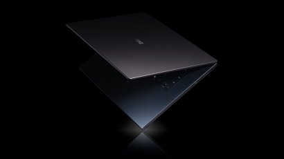
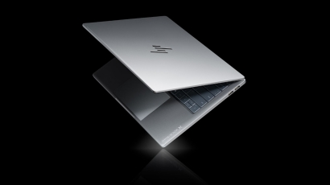
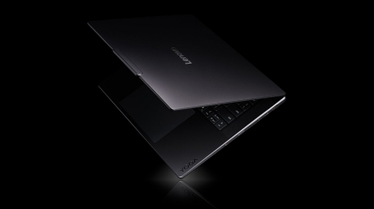
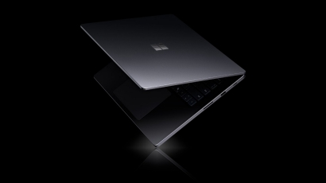
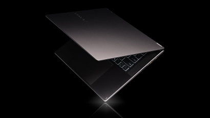

# Slim Laptops & Small Desktops | NVIDIA RTX Spark

- Source URL: https://www.nvidia.com/sv-se/products/rtx-spark/
- Source title: Slim Laptops & Small Desktops | NVIDIA RTX Spark
- Source slug: nvidia-rtx-spark-product
- Captured date: 2026-07-07
- Publisher: NVIDIA
- Page language: sv-se
- Capture mode: rendered capture via Codex in-app Browser

## NVIDIA RTX Spark

Original image URL: https://www.nvidia.com/content/dam/en-zz/Solutions/raw-html-components/banners/still-frame-laptop-1350x1000.jpg

Nearby text: NVIDIA RTX Spark / En ny början.

### En ny början.

Vi presenterar NVIDIA RTX SparkTM Superchip. Fusionen av NVIDIA AI och RTX-grafik i ett enda chip omdefinierar Windows-datorer och levererar fantastiskt skapande, AI-utveckling och spel - på de tunnaste, vackraste bärbara RTX-datorerna någonsin och små, ultraeffektiva stationära datorer.

## RTX Spark Superchip

### Sinne och muskler - allt i ett

Specifikationer och egenskaper som visas i sidan:

- Upp till 6 144 kärnor: Blackwell RTX GPU
- 20 kärnor: Grace CPU
- 1 Petaflop: FP4 AI-prestanda
- 128 GB: Enhetligt minne

### Byggd för agenter och AI

CUDA, den programvara som accelererar världens AI, körs inbyggt på RTX Spark.

### Batteritid hela dagen

Det mest energieffektiva RTX-chippet som någonsin gjorts, i ett chassi så tunt att du glömmer att du bär det.

### Kreatörsskapad

Förverkliga en miljon idéer med hundratals kreativa appar och AI-verktyg som boostas av RTX- och NVIDIA Studio-verktyg.

### Redo för spel

Spela de senaste och bästa spelen med världsledande spelteknik. Strålspårningsvärldar, den fullständiga DLSS-sviten, NVIDIA Reflex och G-SYNC.

## Agenter

Original image URL: https://www.nvidia.com/content/nvidiaGDC/se/sv_SE/products/rtx-spark/_jcr_content/root/responsivegrid/nv_container_1047900/nv_image.coreimg.100.1070.jpeg/1780173289127/nvidia-rtx-spark-agents-ari.jpeg

Caption/alt text: AI agent PC working alongside user tasks

### Din dator förvandlades precis från ett verktyg till en lagkamrat

Välkommen till datorn där agenter arbetar vid din sida - kör uppgifter, genererar resurser, skriver kod, på begäran. Du ställer in målet. Maskinen hanterar resten. Det finns nu intelligens på båda sidor av tangentbordet.

## Gör mer, koda mer, spela mer

Original image URL: https://www.nvidia.com/content/nvidiaGDC/se/sv_SE/products/rtx-spark/_jcr_content/root/responsivegrid/nv_container_1459706020/nv_container/nv_teaser.coreimg.100.410.jpeg/1780218394422/nvidia-rtx-spark-creators-1080x1440.jpeg

Caption/alt text: NVIDIA Broadcast for sharper streams

### Din kreativa kraft, frisläppt

Varje kreativt arbetsflöde får sin egen accelerator. FP4 Tensor Cores och enhetligt minne för de senaste modellerna. RT Cores plus DLSS för 3D-renderingar i realtid. 4:2:2 maskinvarukodning och avkodning för inbyggda, färgkorrekta tidslinjer. AV1-kodare och NVIDIA Broadcast för skarpare strömmar och renare ljud.

Original image URL: https://www.nvidia.com/content/nvidiaGDC/se/sv_SE/products/rtx-spark/_jcr_content/root/responsivegrid/nv_container_1459706020/nv_container/nv_teaser_81179541.coreimg.100.410.jpeg/1780218415665/nvidia-rtx-spark-developers-1080x1440.jpeg

Caption/alt text: NVIDIA CUDA AI development and prototyping stack

### AI-standarden

Samma NVIDIA CUDA(R)-stack som världens AI är byggd på, så att du kan utveckla och skapa prototyper på samma maskin. Och med upp till 128 GB enhetligt minne kan du skapa prototyper, finjustera och utföra inferens på de senaste modellerna.

Original image URL: https://www.nvidia.com/content/nvidiaGDC/se/sv_SE/products/rtx-spark/_jcr_content/root/responsivegrid/nv_container_1459706020/nv_container/nv_teaser_593068029.coreimg.100.410.jpeg/1780218473588/nvidia-rtx-spark-gamers-1080x1440.jpeg

Caption/alt text: RTX gaming with ray tracing and DLSS performance

### Redo för spel

Upplev de senaste och bästa spelen med RTX. Strålspårad belysning för otrolig inlevelse. Den fullständiga sviten med DLSS-tekniker. Spelvinnande respons med NVIDIA Reflex. Maskinvaran som definierade modernt PC-spelande.

## RTX-plattform

### Över 1 000 accelererade appar och spel, miljontals sätt att använda dem

RTX ger dig exklusiva funktioner och de senaste framstegen inom AI, simulering och strålspårning. Upplev otrolig 3D-prestanda, smidigare videoredigering, fotorealistiska simuleringar och fantastisk grafik i de appar, AI-verktyg och spel som proffs, kreatörer och spelare använder varje dag.

Original image URL: https://www.nvidia.com/content/dam/en-zz/nvidiaweb/products/rtx-spark/nvidia-rtx-spark-app-game-wall-ari.png

Caption/alt text: RTX acceleration across apps, AI tools, and games

## Premium Inside and Out

The page presents example RTX Spark laptop systems in a visual gallery:

Original image URL: https://www.nvidia.com/content/nvidiaGDC/se/sv_SE/products/rtx-spark/_jcr_content/root/responsivegrid/nv_container_1149957850/nv_container_1054244/nv_teaser.coreimg.100.410.jpeg/1780173289495/nvidia-rtx-spark-gallery-asus-ari.jpeg

Nearby heading: ASUS ProArt P16

Original image URL: https://www.nvidia.com/content/nvidiaGDC/se/sv_SE/products/rtx-spark/_jcr_content/root/responsivegrid/nv_container_1149957850/nv_container_1054244/nv_teaser_577496959.coreimg.100.410.jpeg/1780173289507/nvidia-rtx-spark-gallery-dell-ari.jpeg

Nearby heading: Dell XPS 16

Original image URL: https://www.nvidia.com/content/nvidiaGDC/se/sv_SE/products/rtx-spark/_jcr_content/root/responsivegrid/nv_container_1149957850/nv_container_1054244/nv_teaser_1718955009.coreimg.100.410.jpeg/1780173289519/nvidia-rtx-spark-gallery-hp-ari.jpeg

Nearby heading: HP OmniBook X 14

Original image URL: https://www.nvidia.com/content/nvidiaGDC/se/sv_SE/products/rtx-spark/_jcr_content/root/responsivegrid/nv_container_1149957850/nv_container_1054244/nv_teaser_735190088.coreimg.100.410.jpeg/1780173289530/nvidia-rtx-spark-gallery-lenovo-ari.jpeg

Nearby heading: Lenovo Yoga Pro 9n

Original image URL: https://www.nvidia.com/content/nvidiaGDC/se/sv_SE/products/rtx-spark/_jcr_content/root/responsivegrid/nv_container_1149957850/nv_container_1054244/nv_teaser_1969608187.coreimg.100.410.jpeg/1780173289542/nvidia-rtx-spark-gallery-microsoft-ari.jpeg

Nearby heading: Microsoft Surface Laptop Ultra

Original image URL: https://www.nvidia.com/content/nvidiaGDC/se/sv_SE/products/rtx-spark/_jcr_content/root/responsivegrid/nv_container_1149957850/nv_container_1054244/nv_teaser_1160448385.coreimg.100.410.jpeg/1780209909077/nvidia-rtx-spark-gallery-msi-ari.jpeg

Nearby heading: MSI Prestige N16 Flip AI+

## RTX Spark stationära datorer

### Litet fotavtryck. Hög prestanda.

Få RTX Spark i en liten, ultraeffektiv stationär dator. Byggd för att köra personliga AI-agenter 24/7 direkt vid ditt skrivbord samt spela och skapa med den fulla kraften hos RTX-grafik.

Registrera dig för att få ett meddelande när bärbara och stationära RTX Spark-datorer är tillgängliga.

## Capture Notes

-正文 boundary: captured from the product hero through the RTX Spark desktop availability prompt. Site navigation, regional banner, copyright footer, legal links, and support/contact/footer navigation were excluded.
- Media kept: 12 rendered page images that support the main product narrative or product gallery.
- Media rejected: decorative metric icons, feature icons, and partner logos were visible but excluded as non正文/UI-style imagery. No screenshots were used as source images.
- Browser note: the page loaded successfully in the rendered browser. The browser DOM snapshot helper failed on this page, so extraction used read-only rendered DOM evaluation after scrolling through lazy-loaded content.
