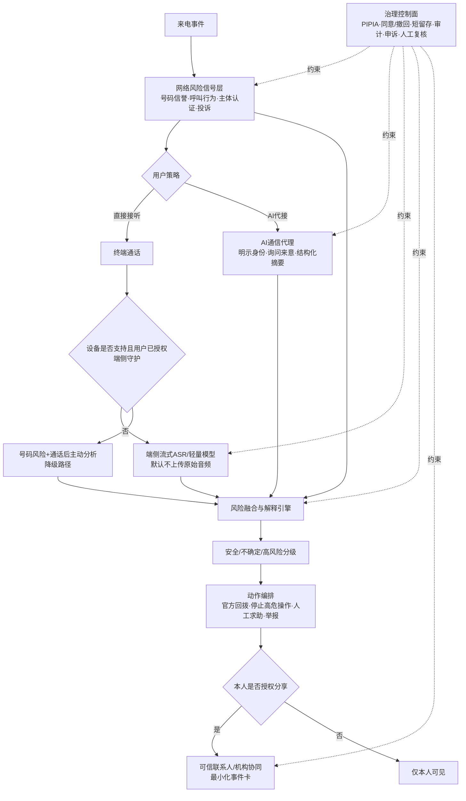

# AI防诈通信管家 · 场景化创新方案

> **文档编号**：场景化创新-AI防诈通信管家-2026  
> **版本**：v2.0（证据增强稿）  
> **研究截点**：2026-07-17  
> **适用场景**：创新立项 / 产品评审 / 运营商内部汇报 / 试点设计 / Demo制作  
> **适用范围**：中国大陆蜂窝语音通话及与其直接关联的短信；普通成年人为基础用户，经本人授权的老年用户—成年子女为重点试点人群

> [!important] 证据标识
> - **【已证实】**：法律、主管部门材料、标准、平台官方文档或运营商官方产品页可直接支持。
> - **【方案设计】**：基于已证实能力提出的产品组合，尚不代表已商用。
> - **【待试点】**：技术上存在路径，但需要运营商、终端厂商、法务或合作机构共同验证。
> - **【中长期】**：依赖网络、终端和跨网互通改造，不能拍成“现网已有”。

---

## 0. 执行摘要

### 0.1 一句话定位

> **AI防诈通信管家，不是“监听每一通电话的AI”，而是以运营商号码与网络风险信号为底座，以明确告知的AI代接、受支持终端的端侧辅助、官方回拨核验和经本人授权的家庭协同为抓手，在“接听前—通话中—挂断后”连续降低受骗概率。**

### 0.2 对原“AI电话秘书”Idea的关键升级

原方案中“陌生来电由AI代接并生成摘要”的产品方向有价值，但它本身已不是空白市场：中国电信官方协议已经列出陌生拦截、来电/拦截验证和智能接听，中国联通也把“智能应答PLUS”放入会员权益。因此，本方案不再把“AI代接”包装为唯一创新，而将它作为交互入口，创新重点升级为**可解释的防诈决策链**。[中国电信《天翼防骚扰用户协议》](https://donotcall.189.cn/agreement.html)；[中国联通PLUS会员页面](https://qy.chinaunicom.cn/mobile-h5/plus/orderPage.html?channelid=297172)

| 原Idea | 升级后的AI防诈通信管家 |
|---|---|
| AI替用户接陌生电话 | AI代接仅是一个入口；前有号码/网络风险，后有官方核验与处置 |
| 以“摘要”作为结果 | 输出身份可信度、风险理由、反证、建议动作和不确定性 |
| 强调运营商“唯一能做” | 明确运营商、终端厂商、银行、公安公共能力各自边界 |
| 默认全量智能接听或监听 | 用户选择代接；端侧语义仅在支持机型上显式开启；不默认上传原始音频 |
| 疑似诈骗自动告警子女 | 由机主事先授权，事件发生时再次确认；最小化共享，允许随时撤回 |
| 直接写全国收入、估值和高准确率 | 用现有资费锚点、A/B定价、单位经济公式和受控试点来验证 |

### 0.3 立项结论

**建议立项，但立项对象应是12—18个月的“受控试点/有限商用验证”，不是全国全量上线。**

优先组合：

1. **现网号码与行为风险卡**：不依赖通话内容即可落地。
2. **明确告知的AI代接核验**：用户主动开启或按规则转移，AI先向主叫说明身份，再询问“您是谁、来电事项、可否通过官方号码回拨”。
3. **挂断后的独立官方核验**：不回拨来电显示号码，而是从可信目录发起官方渠道验证。
4. **经本人授权的家庭协同**：默认只共享高风险事件和建议动作，不共享完整通话或持续位置。
5. **Android/OEM端侧语义试点**：仅在获得系统级能力的机型上验证；iPhone和非合作Android走降级路径。

不应在首期承诺：

- 运营商网络侧默认实时理解所有普通通话；
- 仅凭关键词、声纹或“AI声音”自动挂断；
- 自动报警、自动冻结资金或家属“一键接管”本人通信；
- “零误报”“识破所有诈骗”“根治电诈”；
- 未经试验支撑的全国用户数、收入、毛利率和估值。

### 0.4 四个非补偿性硬门槛

任何一项不达标，试点都不应扩大：

| 硬门槛 | 必须回答的问题 | 首期通过条件 |
|---|---|---|
| **G1 增量减险** | 相比12381、现有拦截和普通安全教育，是否真的多减少了高风险行为？ | 在真实或高保真受控实验中，独立核验、停止转账/屏幕共享等安全行为显著改善；不能只看模型准确率 |
| **G2 合规与通信秘密** | 每一类数据为什么处理、处理多久、谁能看到、如何撤回？ | 完成个人信息保护影响评估；功能分项授权；主叫获得AI身份告知；有删除、申诉、人工复核 |
| **G3 可用性与自治** | 老年用户能否理解，正常银行/医院/快递电话是否被误伤，家庭协同是否变成控制？ | 有人工兜底、关键电话白名单、本人独立撤回和异常访问日志；长期告警疲劳可控 |
| **G4 单位经济性** | AI、通信、人工服务和获客成本能否被真实收入覆盖？ | 用试点真实用量核算单用户贡献毛利；不以公共免费功能重复收费 |

---

## 1. 场景挑战

### 1.1 业务背景

#### 1.1.1 问题规模：通话仍是大规模公共基础设施，电诈治理仍处高压区

截至2025年底，全国移动电话用户数为**18.27亿户**，这是用户账户/号卡口径，不等于18.27亿自然人；全年移动电话去话通话时长为**2.02万亿分钟**。同期移动语音收入为**1092亿元，同比下降1.7%**，说明传统语音仍拥有巨大触达面，但收入承压，运营商需要把“连接”升级为“可信连接”。[工信部《2025年通信业统计公报》](https://www.miit.gov.cn/jgsj/yxj/xxfb/art/2026/art_bea806f4dd20457cb0158795cc210aa7.html)

司法数据说明电诈并未成为小众问题：最高人民法院披露，2021—2025年全国法院一审审结电信网络诈骗犯罪案件超过15.9万件、判决被告人超过33.8万人；最高人民检察院披露，2025年起诉电信网络诈骗犯罪6.8907万人。两组数据分别是案件/被告人与起诉人数，**不能当作受害人数或市场规模**。[最高法发布会](https://www.court.gov.cn/zixun/xiangqing/490011.html)；[最高检《刑事检察工作白皮书（2025）》](https://www.spp.gov.cn/xwfbh/wsfbh/202603/t20260310_722849.shtml)

#### 1.1.2 重点人群：规模大，但不能把“老年”直接等同于“易受骗”

2025年末中国60岁及以上人口为**3.2338亿，占总人口23.0%**。这足以说明适老化防诈具有广泛公共价值，但年龄本身不是风险判决；产品应依据具体情境、行为和授权提供辅助，避免把所有老年用户标签化。[国家统计局《2025年国民经济和社会发展统计公报》](https://www.stats.gov.cn/xxgk/sjfb/tjgb2020/202602/t20260228_1962662.html)

运营商适老服务也不能只有App：工信部曾明确要求保留一定比例线下营业厅、面对面服务和“一键进入”老年人客服人工专席。因此，本方案必须有电话客服和线下渠道兜底，而不能假设用户会配置复杂权限。[工信部《电信服务质量通告（2021年第1号）》](https://wap.miit.gov.cn/jgsj/xgj/wjfb/art/2021/art_1aeeca6c07e741868e8526686cad2e67.html)

#### 1.1.3 治理基础：行业已经有大量免费防线，新产品必须做“增量价值”

工信部与公安部于2021年上线12381涉诈预警劝阻短信系统，依据公安机关提供的涉案号码，使用大数据和AI识别潜在受害用户并发送预警；工信部2023年工作材料还列出一证通查、反诈名片、跨境提醒、涉诈App安装预警等现有工具。[12381上线公告](https://www.miit.gov.cn/jgsj/waj/gzdt/art/2021/art_b908efde5a11495ead9829bc0f46819b.html)；[工信部2023年行业反诈工作](https://www.miit.gov.cn/xwdt/gxdt/sjdt/art/2023/art_f52146c1deaa43e6913f43f5e0935b5f.html)

这些材料中的“累计拦截量、提醒量”能证明系统在运行，**不能直接证明避免了多少损失，更不能证明运营商已经实时分析普通通话语音**。新产品必须回答：在公共底座之上，它新增了什么可测量的安全行为？

#### 1.1.4 政策窗口：支持反诈AI，但同时要求保护通信秘密与个人信息

《反电信网络诈骗法》要求电信业务经营者承担风险防控责任、对新业务开展涉诈风险安全评估，并支持监测识别、动态封堵等反制技术；同时要求精准防治、保护隐私和个人信息、提供申诉救济。[《反电信网络诈骗法》](https://nxca.miit.gov.cn/ztzl/ffzldxwlzp/art/2022/art_6985069057e24505af500a44aec108a5.html)

2026年《“人工智能+信息通信”行动实施意见》提出发展个人和家庭智能体，并继续推动AI在垃圾短信、骚扰电话和电信网络诈骗治理中的应用。这是明确的政策方向，但不是任何具体功能已经部署的证明。[《“人工智能+信息通信”行动实施意见》PDF](https://www.miit.gov.cn/cms_files/filemanager/1226211233/attach/20265/c24f132ee44a44809048330f3fbbcfe0.pdf)

另一面，《电信条例》保护用户通信自由和通信秘密，《个人信息保护法》要求合法、正当、必要、最小范围、清晰告知、便捷撤回、最短保存期限，并对敏感个人信息、自动化决策和对外提供信息要求更严格的治理。[《电信条例》](https://xzfg.moj.gov.cn/front/law/detail?LawID=1623&Query=)；[《个人信息保护法》](https://www.miit.gov.cn/zwgk/zcwj/flfg/art/2022/art_04a0f1fb5df244e39688fd5372623a8d.html)

**政策结论不是“可以默认监听”，而是“既要反诈，也要把通信秘密、个人信息和申诉机制做成产品架构的一部分”。**

### 1.2 核心场景与用户任务

#### 1.2.1 主场景

67岁的李阿姨接到一个陌生手机号码，对方自称“医保中心”，说她的医保账户涉嫌异地违规，要求立即添加某客服、打开屏幕共享并按指示操作。她无法在几十秒内判断以下问题：

1. 来电显示能否证明对方身份？
2. 对方描述的业务流程是否符合官方规范？
3. “立即处理、不得挂断、转到私聊、屏幕共享、验证码”组合是否构成高风险行为链？
4. 如果挂断，应该拨打哪个独立官方号码核验？
5. 何时需要联系家人、运营商人工专席或96110？

她真正需要的不是一个红色“诈骗”标签，而是**在不被剥夺通信自主权的前提下，获得下一步安全动作**。

#### 1.2.2 用户任务（Jobs to Be Done）

| 阶段 | 用户问题 | 管家应提供的最小帮助 |
|---|---|---|
| **接听前** | 这是谁？号码是否异常？ | 主体身份、号码信誉、风险理由、正常业务反证、是否建议AI代接 |
| **接通前/代接时** | 对方来电做什么？ | AI明确自报身份，询问主叫身份、事项、官方回拨渠道；不索取密码/验证码 |
| **通话中** | 现在是否危险？ | 在支持设备上分级提示“保持谨慎/建议暂停/高风险动作”，不基于单关键词强制挂断 |
| **挂断后** | 我应该做什么？ | 官方号码独立回拨、停止屏幕共享/远程控制、修改账户、举报或联系人工 |
| **家庭协同** | 何时让家人知道？ | 机主授权后，只分享必要的高风险事件和求助状态；本人可撤回 |
| **争议处置** | 如果误拦正常电话怎么办？ | 查看理由、恢复来电、白名单、主叫申诉、人工复核和风险标签衰减 |

### 1.3 现有方案盘点：不是“都不行”，而是能力碎片化

| 方案 | 已证实能力 | 未解决问题 | 证据边界 |
|---|---|---|---|
| **12381/96110/国家反诈公共体系** | 涉案号码驱动的潜在受害者识别、短信预警、劝阻与咨询 | 通话当下缺少个体化、可操作的核验交互 | 公共体系必须作为免费基线，不能重新包装收费 |
| **运营商云端防骚扰** | 号码库、投诉、黑白名单、高频/营销/诈骗类号码拦截 | 新号码、伪造/回收号码、合法关键电话误伤；主要是号码级判断 | 官方协议证明功能存在，不证明准确率 |
| **天翼防骚扰+** | 陌生拦截、来电/拦截验证、AI智能接听；广西页面显示5元/月，陕西特定会员3.5元/月 | 尚无公开证据证明其对普通通话进行实时诈骗语义检测或具有减损效果 | 只能作为现有产品和价格锚点，不能外推全国统一资费 |
| **联通智能应答PLUS** | 呼叫转移后由智能助理应答，作为会员权益 | 未证明诈骗识别能力；捆绑价格不能反推独立ARPU | 证明“运营商AI代接”已有商业底座 |
| **Android Call Screening** | 用户选定的筛选App可在来电前识别、静音或拒绝，5秒内响应 | 官方API没有提供普通通话音频 | 第三方App可做号码筛选，不等于能实时听懂对话 |
| **iPhone Call Directory/Live Caller ID** | 按号码识别和阻断，支持更实时的服务端身份查询 | 公共API未提供原生蜂窝通话双向音频流 | 适合号码风险与身份，不宜承诺后台监听 |
| **Google Pixel Call Screen（海外）** | OS级AI代接、询问来意、实时转写，用户决定接听/挂断 | 机型、国家、语言和场景受限；官方明确并非识别所有垃圾电话，转写也可能不完整 | 证明系统级代接路径可行，不证明中国普遍可用 |

来源：[天翼防骚扰协议](https://donotcall.189.cn/agreement.html)、[广西电信资费页](https://gx.189.cn/accept/zfzq/pc)、[陕西电信资费页](https://wx.sx.189.cn/sx_postage_show/h5/pcDetails?id=706)、[Android CallScreeningService](https://developer.android.com/reference/android/telecom/CallScreeningService.html)、[Apple Call Directory](https://developer.apple.com/documentation/callkit/identifying-and-blocking-calls)、[Apple Live Caller ID Lookup](https://developer.apple.com/documentation/identitylookup/getting-up-to-date-calling-and-blocking-information-for-your-app)、[Google Call Screen](https://support.google.com/phoneapp/answer/9118387?hl=en)。

### 1.4 核心问题

#### P1：号码风险不等于真实身份

来电显示和历史标记有价值，但号码可能被伪造、冒用、转售或重新分配；正常银行、医院、灾害预警、快递也可能因高频外呼被误标。因此，产品必须把“号码信誉”表达为概率信号，并提供独立官方回拨和申诉，而不能把号码标签当成司法结论。FCC公开材料记录了合法银行号码被大规模误标/阻断的案例，可作为误伤风险的跨市场反例；它不能外推中国误报率，但足以否定“号码库不会伤害正常主叫”的假设。[FCC DA 21-772](https://docs.fcc.gov/public/attachments/DA-21-772A1_Rcd.pdf)

#### P2：实时语义能力存在平台断层

运营商可掌握与通信服务有关的号码、时间、呼叫方向和部分IMS信令/计费信息，但这些元数据不等于通话文本或语音内容。Android官方文档说明，捕获`VOICE_CALL/VOICE_UPLINK/VOICE_DOWNLINK`需要保留给系统组件的权限；普通第三方App无法通用获得蜂窝通话双方音频。[Android AudioSource](https://developer.android.com/reference/android/media/MediaRecorder.AudioSource.html)；[Android Sharing Audio Input](https://developer.android.com/media/platform/sharing-audio-input)

iOS公共API主要提供号码识别、阻断及自有VoIP集成，没有公开向普通第三方App提供原生蜂窝通话双向媒体流。因此，首期产品必须设计**完整降级路径**，不能把“全机型实时语义”作为前置条件。

#### P3：风险提示与安全行动之间有断点

“疑似诈骗”只能制造焦虑；真正降低风险需要把提示变成动作：暂停操作、独立回拨官方号码、关闭屏幕共享、联系可信人员、拨打96110、保留证据和提交举报。产品成败应以安全行为和结果衡量，而不是只看模型召回率。

#### P4：家庭守护可能反向侵害本人自主权

家庭成员并不天然等于善意授权者。共享套餐、设备监控和家庭IoT可能被用于骚扰、监视或强制控制；老年人与成年子女对安全和隐私也可能存在分歧。因此，家庭守护必须采用本人主授权、事件级二次确认、最小化共享、访问日志、独立撤回和安全退出。[Brown等关于IoT可滥用性的研究](https://doi.org/10.1177/10778012231222486)；[老年人与成年子女监测偏好研究](https://pubmed.ncbi.nlm.nih.gov/31102442/)

#### P5：告警越多不一定越安全

安全告警会产生习惯化，高频、相似提醒会降低后续关键警告的注意和遵从。因此，系统不能“只要出现验证码/转账就弹红窗”，而要减少噪声、分级干预，并把提示与一个可执行按钮绑定。[SOUPS 2019《The Fog of Warnings》](https://www.usenix.org/conference/soups2019/presentation/vance)

### 1.5 问题边界

本方案解决的是**产品可观察到的蜂窝通话与关联短信风险节点**，不是完整诈骗链。诈骗者可能把用户引导到微信、会议软件、屏幕共享、线下交付或其他运营商网络；银行通常更接近资金转移节点，公安拥有法定调查处置能力，终端厂商掌握系统级交互入口。运营商的合理角色是：

> **可信通信编排者 + 网络风险信号提供者 + 多方安全动作连接器，而不是诈骗案件的最终裁判。**

---

## 2. 创新Idea方案介绍

### 2.1 解决方案

#### 2.1.1 产品定义

**AI防诈通信管家 = 免费公共安全底座 + 可选AI通信代理 + 分级风险解释 + 官方独立核验 + 本人授权协同 + 全链路申诉治理。**

它由六个闭环组成：

1. **可信来电**：在接听前展示主体、号码历史、网络风险和证据来源。
2. **AI代接核验**：用户开启后，AI先自报身份，再询问主叫来意和可验证渠道。
3. **端侧语义辅助**：只在受支持的OEM/系统机型上、经用户显式开启后运行；优先本地处理。
4. **风险融合**：号码、呼叫行为、主体认证、会话行为链、设备侧事件和用户上下文联合判断。
5. **安全行动**：不只给标签，而是提供官方回拨、停止高风险操作、人工帮助、举报等按钮。
6. **家庭/机构协同**：本人授权后通知可信联系人；与银行、保险、公安公共触点协作，但不出售原始通信数据。

#### 2.1.2 五种工作模式

| 模式 | 触发方式 | 数据边界 | 适用终端 | 状态 |
|---|---|---|---|---|
| **A 号码风险模式** | 所有用户基础开启或按法规/业务规则配置 | 号码、呼叫行为、主体认证、举报与风险标签；不读取语音内容 | 全终端，呈现方式依系统 | **现网可做** |
| **B AI代接模式** | 用户对陌生来电、忙碌、夜间等规则主动开启 | 仅处理被明确转接给AI的那一通；先向主叫告知AI身份 | 依呼叫转移/IMS能力 | **已有底座，可增强试点** |
| **C 端侧守护模式** | 用户显式开启；仅支持机型 | 端侧流式ASR和风险判断，默认不上传原始音频；高疑难片段是否上云需单独授权 | OEM合作Android优先 | **待试点** |
| **D 用户主动分析模式** | 用户主动提交短信、链接、截图、录音或摘要 | 仅处理用户选择的材料 | iOS/非合作Android降级路径 | **现网可做** |
| **E 新通话交互模式** | 网络与终端均支持IMS Data Channel | 通话界面承载风险卡片、身份与核验按钮；数据通道不等于语音流 | 支持5G New Calling的网络和终端 | **中长期** |

#### 2.1.3 接听前—通话中—挂断后闭环

| 阶段 | 核心能力 | 用户看到什么 | AI做什么 | AI不能做什么 |
|---|---|---|---|---|
| **接听前** | 可信身份与风险分层 | “机构身份已核验/号码历史有限/近期被投诉”等理由 | 融合号码、主体和呼叫行为信号 | 不把“未知号码”直接判为诈骗 |
| **AI代接** | 主叫身份与来意核验 | 实时或事后摘要、可验证回拨方式 | 自报AI身份；询问机构、事项、工号、官方渠道 | 不索取验证码、密码、银行卡号；不冒充机主 |
| **通话中** | 端侧风险辅助 | 蓝/黄/红三级提示及动作按钮 | 识别行为链和上下文，给出不确定性 | 不因单关键词自动挂断；不宣布对方“违法” |
| **挂断后** | 处置与复盘 | “建议通过XX官方热线核验”“停止屏幕共享”等 | 从可信目录发起独立回拨，生成最小化事件记录 | 不直接回拨可疑来显号码作为核验 |
| **家庭协同** | 求助与共决策 | “是否把本次高风险事件分享给女儿？” | 只分享用户同意的风险卡和求助状态 | 不默认共享完整录音、转写、位置或全部通话史 |

### 2.2 能力成熟度地图

| 级别 | 时间 | 能力组合 | 立项表述 |
|---|---:|---|---|
| **M0 已有公共/商业基线** | 当前 | 12381预警、号码库/行为拦截、反诈名片、举报申诉、部分运营商AI代接 | **现网已存在，不计入“首创”** |
| **M1 可受控试点** | 0—6个月 | 号码风险卡、AI代接结构化核验、官方号码目录、一键回拨、用户主动提交材料、事件级家庭求助 | **首期MVP** |
| **M2 有限商用验证** | 6—18个月 | OEM合作Android端侧语义、行为链风险融合、低风险端侧/高疑难复核、机构协同SLA | **需终端和机构合作** |
| **M3 网络/终端演进** | 18个月以上 | 5G New Calling数据通道风险卡、跨运营商/跨终端身份互认和交互 | **中长期，不能承诺覆盖** |
| **MX 暂不纳入** | 未定 | 网络侧默认复制并实时分析所有普通通话媒体流 | **通信秘密、合法基础、技术与公众接受度均需专项论证** |

### 2.3 关键技术

#### 2.3.1 金字塔总览

```text
                         用户安全行动与自主权
                  ┌─────────────────────────┐
                  │  提示 / 核验 / 求助 / 申诉  │
                  └─────────────────────────┘
                风险解释与策略编排：安全/不确定/高风险
             ┌──────────────────────────────────┐
             │ 号码 + 图谱 + 主体 + 语义 + 行为 + 反证 │
             └──────────────────────────────────┘
           AI代接核验                 端侧语义辅助
      ┌─────────────────┐      ┌────────────────────┐
      │ 明示AI身份/询问来意 │      │ OEM权限/流式ASR/本地模型 │
      └─────────────────┘      └────────────────────┘
       网络号码与信令风险底座 + 可信机构目录 + 公共反诈协同
  ┌────────────────────────────────────────────────────────┐
  │ 最小必要数据、授权撤回、短留存、审计、人工复核、主叫申诉 │
  └────────────────────────────────────────────────────────┘
```

完整方案成立必须同时解决五个关键技术点：

1. **可信身份与号码风险不是一个分数，而是一组可追溯证据。**
2. **语义分析必须有合法、可用、可降级的媒体入口。**
3. **模型必须识别诈骗行为链和正常业务反证，而非只匹配关键词。**
4. **告警必须转化为低摩擦安全动作，并控制告警疲劳。**
5. **治理能力必须与模型能力同步上线。**

#### 2.3.2 T1：号码、主体与呼叫行为的多信号融合

可用信号包括：

- 主叫号码是否通过机构认证、是否与官方公开目录一致；
- 号码近期呼叫频次、接通/短呼模式、投诉和风险标签；
- 号码、设备、账户和呼叫关系的异常关联；
- 用户是否曾与该号码正常联系、是否在本地通讯录；
- 号码标签的新鲜度、来源、证据强度和冲突情况；
- 号码是否存在回收、转售、伪造或主体变更风险。

输出不能只有“高/低风险”，应至少包括：

```yaml
risk_level: 不确定
confidence: 中
supporting_evidence:
  - 号码近期被多名用户投诉
  - 自称机构与公开号码目录不一致
counter_evidence:
  - 未发现异常高频呼叫
recommended_action:
  - 挂断后从官方目录独立回拨
appeal_entry: 查看/申诉标签
```

#### 2.3.3 T2：可告知、可约束的AI代接代理

AI代接应遵循固定安全策略：

1. 开场明确说“您好，我是机主启用的AI通信助手”。如适用，按生成合成内容标识规则评估语音或界面提示要求；AI不得用克隆音色冒充用户本人。[《人工智能生成合成内容标识办法》](https://www.cac.gov.cn/2025-03/14/c_1743654684782215.htm)
2. 只询问业务身份、来意、公开回拨渠道和是否需要机主处理。
3. 不提供机主住址、行程、关系、财务状况等信息。
4. 不索取或重复验证码、支付密码、完整证件号和银行卡号。
5. 遇到“禁止挂断、私下转账、下载陌生App、开启屏幕共享、转到非官方渠道”等组合行为时，提高风险等级。
6. 输出结构化摘要时区分“主叫自述”与“系统核验”，例如“对方自称某银行”，不能写成“某银行来电”。
7. AI不作司法定性，只说“存在X项风险特征，建议通过Y官方渠道核验”。

#### 2.3.4 T3：端侧语义辅助与平台降级

**Android合作机型路径**：运营商与OEM/系统拨号器合作，在系统级权限范围内进行端侧流式ASR和轻量风险判断；明确显示功能运行状态；默认不上传原始音频；只有用户同意且模型无法确定的片段才进入受控复核。

**普通Android App路径**：只做号码筛选、身份、用户主动提交和通话后处置，不能宣称通过普通录音权限稳定获取蜂窝通话双方音频。

**iPhone路径**：使用Call Directory/Live Caller ID类能力做号码识别与风险信息；AI代接依赖可用的系统/运营商路径；通话中语义功能不作为普遍承诺。

**5G New Calling路径**：3GPP IMS Data Channel是可选、需要终端与网络共同支持并进行SIP/SDP协商的能力。它可以承载身份卡、风险说明和核验按钮，但数据通道与语音媒体是不同组件，不能写成“Data Channel自动把通话语音交给AI”。[3GPP TS 24.186](https://www.etsi.org/deliver/etsi_ts/124100_124199/124186/18.05.00_60/ts_124186v180500p.pdf)；[3GPP TS 26.114](https://www.etsi.org/deliver/etsi_ts/126100_126199/126114/17.08.00_60/ts_126114v170800p.pdf)

#### 2.3.5 T4：行为链检测、反证与模型路由

推荐采用四级模型路由，而不是每秒都调用大模型：

1. **L0 规则层**：高危动作与官方流程冲突规则，毫秒级、可解释。
2. **L1 轻量模型层**：在端侧/边缘识别话题、压力策略和风险行为组合。
3. **L2 关系图谱层**：号码、主体、设备、投诉和历史关系融合。
4. **L3 大模型复核层**：只处理难判样本，输出支持证据、反证、不确定性和安全动作。

研究显示，大模型实时诈骗对话检测在实验数据上有潜力，但当正常对话刻意包含敏感词时，精确率会明显下降；加入“不确定”状态可改善精确率，却会牺牲召回和告警时机。因此，真实产品必须保留“不确定”，并在中国语言、方言、电话编码、噪声和诈骗漂移条件下重新验证。[CHI 2025研究](https://doi.org/10.1145/3706599.3720263)

另一项EMNLP 2025研究支持“轻量筛选—专家规则—大模型反思”的多级路径，但研究场景主要是招聘平台通话，不能直接当作中国运营商蜂窝通话效果。[EMNLP 2025](https://aclanthology.org/2025.findings-emnlp.270/)

#### 2.3.6 T5：深伪检测只能是辅助信号

电话信道、压缩、采样率、带宽和未知生成器会显著改变深伪检测难度；ASVspoof 2021专门把PSTN/VoIP传输和不同编解码纳入挑战。系统即使判断“可能是合成语音”，也不能据此判断“对方是诈骗者”：真人可以诈骗，合法客服和无障碍场景也可能使用TTS。[ASVspoof 2021](https://www.isca-archive.org/asvspoof_2021/yamagishi21_asvspoof.html)；[CodecFake, Interspeech 2024](https://www.isca-archive.org/interspeech_2024/wu24p_interspeech.html)

产品表述应是：**“疑似合成语音信号，仅供风险融合参考”**，不得是“检测到AI声音，确认诈骗”。

#### 2.3.7 T6：干预策略与人因设计

| 状态 | 用户提示 | 默认动作 | 设计原则 |
|---|---|---|---|
| **蓝色：信息不足** | “陌生来电，暂未发现明显异常” | 允许接听/AI代接 | 不把未知等同危险 |
| **黄色：需要核验** | “对方身份与官方目录不一致，建议挂断核验” | 展示官方回拨按钮 | 给理由、给反证、给动作 |
| **红色：高风险行为** | “对方正要求屏幕共享并索取验证码，建议立即停止操作” | 暂停敏感操作指引、人工求助 | 红色提示必须稀疏且高行动性 |
| **灰色：系统不确定** | “网络/语音条件不足，无法判断” | 提示人工或官方核验 | 明确承认模型边界 |

首期不建议基于模型自动挂断。若未来为极高风险场景提供自动中止，必须由用户事先选择、支持紧急恢复，并经过合法性、误伤和可用性专项评估。

### 2.4 技术架构



### 2.5 技术栈

| 层级 | 组件 | 推荐技术/能力 | 核心约束 |
|---|---|---|---|
| **网络接入层** | IMS/MMTel、呼叫转移、号码认证、计费/信令事件 | 运营商现网能力、风险标签API | 信令/计费字段不等于语音内容；字段采集与实时性依实际部署 |
| **新通话层** | IMS Data Channel、应用服务器、数据通道服务器 | 3GPP TS 24.186/26.114 | 可选能力，需网络和终端协商；不能假设全国覆盖 |
| **终端层** | Android系统拨号器、Call Screening、iOS Call Directory/Live Caller ID | OEM SDK、系统组件、本地安全区 | 普通App权限不足；按机型、系统版本和地区建立兼容矩阵 |
| **语音层** | VAD、流式ASR、说话人分离、TTS | 端侧小模型、边缘推理、多方言评测 | 不默认保存原始音频；识别误差必须进入风险置信度 |
| **风险智能层** | 规则引擎、图模型、轻量分类器、LLM复核、深伪辅助 | 多级路由、RAG可信知识库、模型校准 | 不得只用关键词；每次更新需回归测试和漂移监测 |
| **知识层** | 官方机构目录、业务流程规则、反诈话术特征、正常业务反证 | 有版本和来源的知识库 | 官方号码和流程要定期复核，过期条目自动失效 |
| **动作编排层** | 独立回拨、人工专席、96110/12381提示、可信联系人 | 事件总线、策略引擎、SLA | 不能冒充公安；紧急联系范围和接口需官方协议支持 |
| **治理层** | 同意中心、访问控制、加密、留存/删除、审计、申诉 | RBAC/ABAC、KMS、隐私计算、审计日志 | 每一项数据都有目的、期限、角色和退出路径 |
| **运营层** | 模型监控、标签复核、主叫申诉、灰度发布 | MLOps、A/B实验、可观测性 | 同时监测漏报、误报、投诉、撤回、人工负荷和公平性 |

### 2.6 数据治理与合规设计

#### 2.6.1 最小化数据地图

| 数据 | 用途 | 默认处理位置 | 建议保留 | 分享规则 |
|---|---|---|---|---|
| 号码与呼叫事件 | 来电识别、风险评分、计费与申诉 | 运营商安全域 | 按法定/业务必要最短期限 | 不向商业伙伴出售原始明细 |
| 号码风险证据 | 解释标签、复核和纠错 | 运营商风险平台 | 设有效期和衰减 | 主叫可查看理由并申诉 |
| AI代接音频/转写 | 完成用户明确委托的代接、摘要和核验 | 受控云/边缘 | 默认完成摘要后删除音频；具体期限经PIPIA确定 | 对主叫告知；不用于通用训练，除非另行取得合法授权 |
| 端侧实时文本 | 当通电话的风险辅助 | 端侧优先 | 通话结束即删或由用户选择保存 | 默认不上云；高疑难复核需单独授权 |
| 风险事件卡 | 用户复盘、求助和申诉 | 用户账户/运营商 | 用户可见、可删；高风险审计期限另定 | 家庭分享按事件、按字段、可撤回 |
| 家庭关系与授权 | 确定通知对象和权限 | 运营商账户安全域 | 关系结束即失效 | 双方可见；机主拥有独立撤回权 |

#### 2.6.2 必做治理清单

- 为AI代接、端侧守护、云端复核、家庭分享分别授权，不能用一个总开关打包同意。
- 处理前说明目的、方式、数据类型、保存期限、接收方和权利入口；撤回应与开启同样容易。
- 对敏感信息、自动化决策、委托模型服务商、向家庭成员/合作机构提供信息开展个人信息保护影响评估并留存记录。
- 对重大影响的自动化判断提供解释、人工复核和拒绝“仅由自动化决策”的路径。
- 不满14周岁未成年人不是首期默认对象；若进入，需要专门规则和监护人同意，同时防止监护权限无限扩大。
- 模型、ASR、云服务商作为受托处理方时，明确目的、期限、再委托限制、数据返还/删除和安全事件责任。
- 代接必须清晰告知主叫正在与AI交互；如有录音/转写和留存，需根据具体架构完成双边告知与合法基础评估。
- 用户营销订购和数据处理同意分开；免费赠送、自动续订、代扣费必须有明确订购凭证和到期提醒。[工信部“明白办、放心用”行动](https://www.miit.gov.cn/jgsj/xgj/fwjd/art/2025/art_3fe21f8b878140c1b1eb9e7a5c44cb85.html)

### 2.7 威胁—控制矩阵

| 威胁/失败条件 | 为什么会发生 | 设计控制 | 验证指标 |
|---|---|---|---|
| **新号/伪造号绕过号码库** | 号码信誉有冷启动，来显不等于身份 | 主体认证+行为图谱+独立官方回拨；未知不等于安全 | 新号码场景召回、核验完成率 |
| **正常银行/医院被误拦** | 高频外呼、共享号码、第三方客服 | 关键行业反证、白名单、快速申诉、标签衰减、阻断可恢复 | 关键电话误拦率、平均纠错时长 |
| **诈骗者避开关键词** | 话术漂移、分阶段诱导、转移到OTT | 行为链和多模态事件融合；模型版本化 | 跨时间/跨话术稳健性 |
| **ASR在方言/噪声/窄带下失效** | 电话编码、弱网、多人说话 | 多条件评测；不确定状态；端云协同 | 按方言/设备/网络分组的误差与风险性能 |
| **深伪检测误导** | 编解码扰动、未知生成器、合法TTS | 只作辅助特征，不单独阻断 | 真实电话信道下的校准误差 |
| **告警疲劳** | 提示过多、理由相似、没有动作 | 分级、稀疏、个性化阈值；每条红色告警绑定动作 | 长期提示遵从、关闭率、每千通告警数 |
| **家庭守护被滥用** | 控制型关系、账号被盗、默认持续共享 | 机主主授权、事件级确认、访问日志、独立撤回、安全退出 | 未授权访问、撤回成功率、投诉分类 |
| **AI代接泄露用户信息** | 生成式模型越权回答或提示注入 | 固定披露、最小知识、敏感字段拒答、红队测试 | 敏感信息泄露率、越权任务成功率 |
| **把风险标签当定罪** | 用户对AI过度信任 | 概率和理由表达、反证、人工复核、禁止司法化措辞 | 解释理解度、错误定性投诉 |
| **成本失控** | 全量ASR/大模型调用、人工复核过多 | 规则/小模型先筛、难例才调用大模型、配额与缓存 | 每通成本、每活跃用户成本、人工转接率 |

### 2.8 指标体系：四层效果，商业指标单列

#### 2.8.1 模型层

- 号码风险、行为链、语义和深伪辅助分别报告精确率、召回率、PR-AUC、校准误差；不能合成一个“AI准确率”。
- 按方言、年龄、终端、VoLTE/VoWiFi、网络质量、诈骗类型和正常机构类型分组。
- 将“安全/不确定/高风险”作为三类输出，报告进入不确定的比例及人工复核结果。

#### 2.8.2 交互层

- 风险理由理解率、建议动作找到率、完成独立回拨时间；
- 正常关键电话误伤率、AI代接放弃率、告警关闭率；
- 老年用户独立完成率、人工专席转接成功率；
- 家庭授权理解率、撤回成功率和未授权访问投诉。

#### 2.8.3 行为层

- 与对照组相比，用户是否更可能暂停屏幕共享、拒绝提供验证码、挂断并从官方目录回拨；
- 高风险提示后24小时内是否完成官方核验；
- 用户是否从可疑来电转入其他高风险渠道。

#### 2.8.4 结果层

- 经严格定义和人工核验的疑似受骗事件、实际损失和及时止损；
- 不能以“拦截次数”替代减损，也不能把所有行为变化归因于产品；
- 建议采用随机或准实验设计、预注册指标和独立评估。

#### 2.8.5 商业层

- 激活率、7/30/90日留存、功能分项使用率；
- 免费到付费转化、每户ARPU、退订和投诉；
- 单用户ASR/TTS/模型/人工/通信成本、贡献毛利；
- 渠道触达成本、客服负荷、申诉处理SLA；
- 银行/保险等机构是否愿意为增量服务付费，而非为获取原始数据付费。

### 2.9 12—18个月试点路线

| 阶段 | 时间 | 范围 | 交付物 | 退出条件 |
|---|---:|---|---|---|
| **0 合规与证据建模** | 0—2个月 | 单省/单运营商；法务、安全、反诈、客服共同参与 | 数据流图、PIPIA、威胁模型、正常业务反证库、评测协议、用户研究伦理与知情同意方案 | 无法给通话内容处理找到明确合法路径；家庭授权无法安全撤回 |
| **1 无内容MVP** | 2—5个月 | 号码风险卡、AI代接核验、官方目录、通话后动作 | 可点击原型、代接脚本、申诉后台、事件卡 | 关键电话误伤无法控制；用户不理解风险理由 |
| **2 小规模封闭试点** | 5—9个月 | 自愿用户1—2个城市；老年用户与成年子女需本人同意 | A/B提醒、定价实验、人工复核、行为评估 | 增量安全行为无改善；告警关闭/投诉过高 |
| **3 OEM端侧试点** | 8—14个月 | 少量合作Android机型 | 端侧ASR、轻量模型、隐私与兼容矩阵 | 真实电话条件下性能不稳定；电量/时延/成本不可接受 |
| **4 有限商用决策** | 12—18个月 | 扩大到更多城市/机型，但仍灰度 | Go/No-Go报告、单位经济、合作SLA、外部审计摘要 | 四个硬门槛任一不通过则不扩张 |

### 2.10 Go / No-Go决策表

| 维度 | Go | 调整后再试 | No-Go |
|---|---|---|---|
| 增量减险 | 安全行为和结果相对基线改善，且可重复 | 仅模型指标改善，用户行为未改善 | 与基线无差异或诱发更高风险行为 |
| 合规 | 分项授权、告知、撤回、短留存、申诉均可运行 | 个别供应商/流程需整改 | 依赖默认监听或无法约束二次使用 |
| 可用性 | 老年用户能独立理解；关键电话误伤可控 | 需增加人工和界面改造 | 正常通信损害或家庭控制风险无法接受 |
| 经济性 | 真实付费/机构合同可覆盖增量成本 | 需降模型/人工成本或重构套餐 | 只能通过给基础安全功能收费维持 |

---

## 3. 创新Idea商业价值

### 3.1 战略价值

#### 3.1.1 从“语音管道”升级为“可信通信服务”

移动语音规模仍大而收入下降，运营商若只提供连接，价值会继续被终端和互联网应用吸收；AI防诈通信管家让运营商用号码、呼叫关系、服务渠道和可信机构合作能力，形成“通信前有身份、通信中有辅助、通信后有处置”的新服务层。

#### 3.1.2 运营商的差异化不是“能听所有电话”

真正优势是：

- 网络侧号码与呼叫行为信号；
- SIM/账户和客户服务关系；
- 云端统一策略与跨设备触达；
- 与12381、96110、12321、银行和可信机构目录衔接的组织能力；
- 可把基础安全能力普惠给非旗舰机、非重度App用户。

需要诚实承认：终端厂商更接近实时界面和音频权限，银行更接近资金风险节点，公安拥有调查处置权限。因此，运营商必须以开放合作赢得主导，而不是用“唯一能做”作为论据。

#### 3.1.3 建立可审计的可信AI样板

产品若把同意、撤回、短留存、不确定性、人工复核和申诉做成系统能力，可沉淀到AI客服、智能助理、家庭健康和企业通信，成为运营商大模型治理底座。

### 3.2 商业价值

#### 3.2.1 收费原则：基础安全免费，增量代理和服务付费

| 层级 | 建议内容 | 付费原则 |
|---|---|---|
| **免费公共层** | 号码风险提示、基础拦截、12381/96110入口、基础举报申诉、紧急人工 | 属于公共安全和运营商责任底座，不应因未付费而降低 |
| **个人AI代理层** | 更多AI代接额度、个性化代接规则、结构化摘要、跨设备同步、官方回拨助手 | 可按月订阅或权益包收费 |
| **家庭协同层** | 2—5人可信联系人、事件级求助、家庭安全报告、人工协助 | 必须由被守护者本人授权；付费不获得无限监控权 |
| **人工保障层** | 7×24人工核验、账户恢复协助、保险/法律咨询转介 | 可由用户、运营商权益或保险机构共同支付 |
| **机构协同层** | 银行/保险/平台为客户提供独立核验、受骗后服务SLA和联合运营 | 机构为服务效果付费，不购买用户原始通话和敏感数据 |

海外运营商也常采用“基础呼叫安全免费、身份/金融保障和便利服务付费”的freemium结构。例如AT&T把基础诈骗/垃圾来电防护提供给无线用户，Advanced再销售身份、金融监测、恢复和保险类增值；这只能作为商业模式对照，不能直接照搬美国价格和制度。[AT&T ActiveArmor](https://www.att.com/blog/what-is-the-att-activearmorsm-mobile-security-app/)

#### 3.2.2 价格不是拍脑袋：已有锚点 + 三组实验

**已证实价格锚点**：广西电信官方页面显示天翼防骚扰+标准资费5元/月；陕西特定星级会员页面显示3.5元/月。它证明AI代接/防骚扰增值服务存在付费类目，**不证明全国统一价格、用户愿付费或本方案价值**。

建议试点定价实验：

| 组别 | 价格假设 | 权益 | 要验证的问题 |
|---|---:|---|---|
| A | **0元基础版** | 号码风险、基础行动、举报申诉 | 免费底座的激活和行为改善 |
| B | **5元/月个人版** | AI代接额度、摘要、官方回拨助手 | 能否承接现有市场价格心智 |
| C | **9元/月家庭版** | 个人版 + 2名可信联系人 + 事件级协同 | 家庭协同是否有增量价值且不侵害自治 |
| D | **15元/月保障版** | 家庭版 + 人工核验/恢复协助权益 | 用户是否愿意为“有人处理”而非“AI标签”付费 |

上述价格全部是**试验假设**，不能写进财务预测为既定事实。应同时测试单独订阅、老年/全球通等权益包、宽带家庭套餐附加和银行联合补贴，避免只测一种销售方式。

#### 3.2.3 单位经济模型

不再使用未经证实的“3000万付费用户、45亿元年收入、60%—70%毛利率”。采用可审计公式：

```text
月度贡献毛利
= 激活用户数 N × 付费转化率 p × 月ARPU a
- AI代接/ASR/TTS/大模型变动成本 c_ai
- 通信与存储成本 c_tel
- 人工核验与申诉成本 c_human
- 渠道分成与支付成本 c_channel

单付费用户贡献 = a - (c_ai + c_tel + c_human + c_channel)
回收期（月） = 单个付费用户获客成本 CAC ÷ 单付费用户月贡献
```

试点必须按功能拆成本：AI代接平均时长、端侧/云端ASR比例、大模型复核占比、人工转接率、申诉率和家庭事件数。若只有全量大模型调用才能获得可接受效果，应优先重构架构，而不是用虚假规模效应掩盖成本。

#### 3.2.4 三条收入路径

1. **C端订阅/权益包**：售卖个人代理、家庭协同和人工服务，不售卖基础风险提示。
2. **B2B2C联合权益**：银行、保险、养老服务或高端套餐为特定用户支付增量服务费；需要真实合同验证，不能预设采购意愿。
3. **能力平台**：向可信机构输出“已授权的核验会话、风险动作编排和申诉SLA”，不输出原始通话数据或可反向识别的用户画像。

#### 3.2.5 可形成的壁垒

- 经治理的跨域风险信号和正常业务反证库；
- 运营商—OEM—银行—公共反诈触点的动作编排和SLA；
- 真实电话条件下的多方言、多终端评测集；
- 用户信任、撤回、申诉和主叫纠错的治理体系；
- 端侧小模型与云端难例复核的成本优化。

不能作为壁垒的内容：单一LLM、通用ASR、简单关键词规则、把公共数据封闭收费、宣称网络侧天然拥有全部通话语义。

### 3.3 社会价值

1. **把反诈从“事后教育”前移到“当下决策”**：在高风险动作发生前提供暂停、核验和求助。
2. **提升公共预警的可行动性**：把12381等公共触点与官方回拨、人工帮助和举报连接起来。
3. **适老但不歧视**：为不会配置复杂App的用户提供AI代接和人工兜底，同时不把年龄当作风险定罪。
4. **保护正常通信**：通过反证、白名单、申诉和标签衰减，减少银行、医院、快递、政府服务等关键电话被误伤。
5. **形成负责任AI示范**：公开能力边界、显示不确定性、保护通信秘密和个人信息。

### 3.4 主要风险与管理责任

| 风险 | 责任部门 | 上线前证据 |
|---|---|---|
| 通信内容处理合法性不足 | 法务/合规/网络安全 | 数据流逐项合法基础、PIPIA、双边告知方案 |
| AI误判导致损失或延误 | 产品/算法/客服 | 校准评测、关键行业误伤测试、人工复核和赔付/责任条款 |
| 家庭守护变成监控 | 产品/隐私/安全 | 本人授权、事件级分享、访问日志、独立撤回和安全退出测试 |
| 主叫身份被错误标记 | 风控/客服/政企 | 证据来源、标签有效期、主叫申诉和纠错SLA |
| 代接模型泄露信息 | AI安全/红队 | 提示注入、敏感信息、越权任务和社会工程红队报告 |
| 夸大宣传 | 市场/法务 | 所有“当前/试点/中长期”标签与证据清单一致 |

---

## 4. Demo演示

### 4.1 Demo定位

**建议时长：90秒。** 片头和每一个未来能力画面都显示“概念原型 / MVP / OEM试点 / 中长期”标签，避免把规划功能拍成现网能力。

Demo只演示一个完整安全闭环：

> 可疑来电 → 风险信息不足 → 用户选择AI代接 → AI明示身份并询问来意 → 发现高风险行为链 → 用户看到理由与不确定性 → 从可信目录回拨官方号码 → 本人决定是否向女儿求助。

### 4.2 90秒分镜脚本

| 镜头 | 时长 | 画面 | 对白/字幕 | 能力标签 |
|---:|---:|---|---|---|
| 1 | 6s | 李阿姨在家收到陌生号码来电，来显下方出现“身份未核验；暂未发现明确异常” | 旁白：“最危险的电话，往往不会先告诉你它危险。” | **M1 概念原型：号码风险卡** |
| 2 | 6s | 页面按钮：“接听 / 由AI先问来意 / 拒绝” | 李阿姨点击“由AI先问来意” | **M0已有代接底座，M1增强核验** |
| 3 | 8s | AI代接界面，顶部持续显示“AI助手正在与主叫沟通” | AI：“您好，我是机主启用的AI通信助手。请说明您的单位和来电事项。” | **M1：明确AI身份** |
| 4 | 8s | 主叫波形和实时结构化字段，不展示未经核验的机构Logo | 主叫：“我是医保中心，你的账户违规，马上加客服处理。” | **M1：主叫自述 ≠ 已核验身份** |
| 5 | 7s | AI继续询问：“可否提供可从官网查询的服务热线和事项编号？” | 主叫回避并要求“不要挂断，打开屏幕共享” | **M1：标准核验脚本** |
| 6 | 8s | 通话结束，风险卡显示黄色升级红色：①机构身份无法核验；②要求转非官方渠道；③要求屏幕共享 | 字幕：“不是因为出现一个关键词，而是出现了连续高风险行为。” | **M1：行为链解释** |
| 7 | 7s | 页面明确显示“系统判断：高风险；仍可能出错” | 按钮：“从官方目录核验 / 联系人工 / 暂不处理” | **M1：不确定性 + 动作** |
| 8 | 8s | 李阿姨点击“从官方目录核验”，系统展示号码来源“政府/机构公开渠道，更新时间” | 旁白：“不回拨来电号码，只从可信目录重新联系官方。” | **M1：独立官方回拨** |
| 9 | 8s | 官方客服确认不存在该事项；界面提示关闭屏幕共享、不要提供验证码 | 官方客服：“请不要按对方指引操作。” | **M1：闭环处置** |
| 10 | 8s | 页面询问：“是否把本次高风险事件卡分享给女儿？仅含风险理由和处理状态，不含完整录音。” | 李阿姨主动点击“分享本次事件” | **M1：本人授权、事件级分享** |
| 11 | 8s | 女儿收到事件卡：“妈妈已完成官方核验，目前安全”，只有“打电话关心”按钮，没有“监听/接管” | 旁白：“守护不是监控，决定权始终属于本人。” | **M1：家庭协同** |
| 12 | 8s | 展示三层路线：现网可做 / OEM试点 / 5G新通话演进 | 片尾：“AI防诈通信管家，让每一次陌生通信都有身份、有解释、有退路。” | **路线图，不冒充现网全覆盖** |

### 4.3 可直接粘贴到剪映的旁白

```text
最危险的电话，往往不会先告诉你它危险。

陌生号码打来时，AI防诈通信管家先展示已有的号码与网络风险证据。
信息还不够？你可以让AI先问来意。

AI会先说明自己是通信助手，再询问对方是谁、什么事、能否通过官方号码回拨。
它不冒充你，也不索取验证码和密码。

当对方回避身份核验，又要求转到私聊、打开屏幕共享，
系统不会只给一个“诈骗”标签，
而是告诉你风险来自哪里、判断有多确定、下一步该怎么做。

一键核验，不回拨可疑号码，直接从可信目录联系官方。

需要家人帮助时，也由本人决定是否分享这一次风险事件。
只分享必要信息，不默认监听，不让守护变成监控。

AI防诈通信管家——
让每一次陌生通信，都有身份、有解释、有退路。
```

### 4.4 Demo UI关键文案

| 错误文案 | 建议文案 |
|---|---|
| “已确认诈骗电话” | “检测到3项高风险特征，建议停止操作并独立核验” |
| “某银行来电” | “对方自称某银行；该身份尚未核验” |
| “AI已替您拦截骗子” | “AI已代接并生成风险摘要；最终决定由您作出” |
| “检测到AI拟声，诈骗！” | “疑似合成语音信号；该结果不能单独证明诈骗” |
| “已自动通知女儿并接管通话” | “是否将本次高风险事件卡分享给女儿？” |
| “5G新通话原生实时识诈” | “中长期：在支持的网络与终端上通过数据通道展示风险交互” |

### 4.5 Demo红线

- 不出现“自动接通反诈中心”“警方已锁定”“资金已冻结”等未经官方机制支持的画面。
- 不展示AI在普通iPhone/Android App中后台监听所有蜂窝通话。
- 不把Data Channel画成语音复制通道。
- 不让女儿看到完整转写、录音、位置和全部通话史。
- 不用真实机构Logo为虚构身份背书。
- 不出现“100%识别、零误报、根治诈骗、运营商独家”等表述。

---

## 附录A：关键事实核验表

| 原稿常见表述 | 核验结果 | 修订后可用表述 |
|---|---|---|
| “中国16亿手机用户” | 口径不严谨；2025年移动电话用户为18.27亿户，不等于自然人 | “2025年末移动电话用户18.27亿户”并注明号卡/账户口径 |
| “老年人受骗占比超过60%” | 未找到可支撑全国该比例的一手官方统计 | 删除比例，只用人口规模和官方重点教育要求 |
| “独居老人1.2亿” | 本轮未找到足够可靠且口径清晰的一手来源 | 不使用 |
| “运营商现网可监听并实时理解通话” | 标准和平台证据均不支持 | “现网优先用号码/信令风险；语义依AI代接或OEM端侧授权路径” |
| “Data Channel推送实时通话摘要” | Data Channel可承载交互数据，但不自动提供语音 | “可展示风险卡和核验按钮；摘要需另有合法媒体/文本来源” |
| “AI代接是全新空白” | 电信、联通已有官方产品底座 | “创新在防诈决策闭环，而非代接本身” |
| “第三方App完全不能筛选电话” | 过度概括；Android/iOS有受限号码识别/拦截API | “普通App能做号码级筛选，公开API不提供通用蜂窝通话双向音频” |
| “5年3000万付费、45亿收入、60%—70%毛利” | 无用户、价格、成本和转化证据 | 改为价格实验、单位经济公式和Go/No-Go门槛 |
| “AI拟声检测可识破诈骗” | 深伪检测受电话信道与未知生成器影响，且不判断诈骗意图 | 仅作辅助风险信号 |
| “家庭实时同步就是守护” | 可能侵害自治并被滥用 | 本人主授权、事件级分享、最小字段、可撤回、访问日志 |

## 附录B：核心证据索引

### B1 法律、政策与官方统计

1. [《中华人民共和国反电信网络诈骗法》](https://nxca.miit.gov.cn/ztzl/ffzldxwlzp/art/2022/art_6985069057e24505af500a44aec108a5.html)：运营商责任、精准防治、风险评估、技术反制、预警劝阻和申诉救济。
2. [《中华人民共和国个人信息保护法》](https://www.miit.gov.cn/zwgk/zcwj/flfg/art/2022/art_04a0f1fb5df244e39688fd5372623a8d.html)：最小必要、告知同意、撤回、保存期限、自动化决策、敏感信息和影响评估。
3. [《中华人民共和国电信条例》](https://xzfg.moj.gov.cn/front/law/detail?LawID=1623&Query=)：通信秘密、经营者安全义务和禁止误导宣传。
4. [工信部12381上线公告](https://www.miit.gov.cn/jgsj/waj/gzdt/art/2021/art_b908efde5a11495ead9829bc0f46819b.html)：现有公共预警机制。
5. [工信部2023年行业反诈工作](https://www.miit.gov.cn/xwdt/gxdt/sjdt/art/2023/art_f52146c1deaa43e6913f43f5e0935b5f.html)：一证通查、反诈名片、跨境提醒等现有底座；累计数字不可直接当因果效果。
6. [《“人工智能+信息通信”行动实施意见》](https://www.miit.gov.cn/cms_files/filemanager/1226211233/attach/20265/c24f132ee44a44809048330f3fbbcfe0.pdf)：个人/家庭智能体与反诈AI政策方向。
7. [工信部《2025年通信业统计公报》](https://www.miit.gov.cn/jgsj/yxj/xxfb/art/2026/art_bea806f4dd20457cb0158795cc210aa7.html)：移动用户、通话时长和语音收入。
8. [国家统计局《2025年国民经济和社会发展统计公报》](https://www.stats.gov.cn/xxgk/sjfb/tjgb2020/202602/t20260228_1962662.html)：60岁以上人口。
9. [最高人民法院发布会](https://www.court.gov.cn/zixun/xiangqing/490011.html)、[最高检《刑事检察工作白皮书（2025）》](https://www.spp.gov.cn/xwfbh/wsfbh/202603/t20260310_722849.shtml)：司法案件/起诉口径。
10. [《人工智能生成合成内容标识办法》](https://www.cac.gov.cn/2025-03/14/c_1743654684782215.htm)：AI生成合成音频/交互标识；私人通话具体适用仍需法务判断。

### B2 现有产品与商业锚点

1. [中国电信《天翼防骚扰用户协议》](https://donotcall.189.cn/agreement.html)：免费能力、诈骗类号码拦截、Plus智能接听、记录与申诉。
2. [广西电信天翼防骚扰+](https://gx.189.cn/accept/zfzq/pc)：当地5元/月价格和功能说明。
3. [陕西电信天翼防骚扰+](https://wx.sx.189.cn/sx_postage_show/h5/pcDetails?id=706)：特定会员3.5元/月和AI机器人代接。
4. [中国联通PLUS会员](https://qy.chinaunicom.cn/mobile-h5/plus/orderPage.html?channelid=297172)：智能应答PLUS权益和呼叫转移底座。
5. [AT&T ActiveArmor](https://www.att.com/blog/what-is-the-att-activearmorsm-mobile-security-app/)、[T-Mobile Scam Shield](https://www.t-mobile.com/benefits/scam-shield)：海外“基础安全免费+增值服务付费”对照；不可直接外推中国价格和效果。

### B3 标准与平台能力

1. [3GPP TS 32.260](https://www.etsi.org/deliver/etsi_ts/132200_132299/132260/16.03.00_60/ts_132260v160300p.pdf)：IMS计费/信令字段；不等于语音内容。
2. [3GPP TS 24.186](https://www.etsi.org/deliver/etsi_ts/124100_124199/124186/18.05.00_60/ts_124186v180500p.pdf)、[TS 26.114](https://www.etsi.org/deliver/etsi_ts/126100_126199/126114/17.08.00_60/ts_126114v170800p.pdf)：IMS Data Channel可选能力、协商和媒体组件边界。
3. [GSMA《5G New Calling》](https://www.gsma.com/futurenetworks/wp-content/uploads/2023/10/GSMA-Foundry-5G-New-Calling-Revolutionising-the-Communications-Services-Landscape.pdf)：产业方向和PoC/预商用背景，不能证明全国商用覆盖。
4. [Android CallScreeningService](https://developer.android.com/reference/android/telecom/CallScreeningService.html)、[AudioSource](https://developer.android.com/reference/android/media/MediaRecorder.AudioSource.html)：号码筛选与音频权限边界。
5. [Apple Call Directory](https://developer.apple.com/documentation/callkit/identifying-and-blocking-calls)、[Live Caller ID Lookup](https://developer.apple.com/documentation/identitylookup/getting-up-to-date-calling-and-blocking-information-for-your-app)：iPhone号码身份与阻断能力边界。
6. [Google Call Screen](https://support.google.com/phoneapp/answer/9118387?hl=en)：OS级AI代接案例及官方限制。

### B4 研究与反例

1. [Shen等，CHI 2025](https://doi.org/10.1145/3706599.3720263)：实时LLM诈骗检测的潜力、误报和告警时机冲突。
2. [Ma等，EMNLP 2025](https://aclanthology.org/2025.findings-emnlp.270/)：诈骗叙事漂移、专家规则和多级模型路径。
3. [Prasad等，USENIX Security 2023](https://www.usenix.org/conference/usenixsecurity23/presentation/prasad)：在合法获得的robocall转写语料上进行内容分类和趋势分析；不证明可默认采集普通通话。
4. [ASVspoof 2021](https://www.isca-archive.org/asvspoof_2021/yamagishi21_asvspoof.html)、[CodecFake 2024](https://www.isca-archive.org/interspeech_2024/wu24p_interspeech.html)：电话信道、编解码和未知生成方式对深伪检测的影响。
5. [Vance等，SOUPS 2019](https://www.usenix.org/conference/soups2019/presentation/vance)：告警习惯化。
6. [FCC DA 21-772](https://docs.fcc.gov/public/attachments/DA-21-772A1_Rcd.pdf)：合法关键电话被误标/阻断的跨市场反例。
7. [Brown等，2025](https://doi.org/10.1177/10778012231222486)：家庭/IoT监控能力的滥用风险。

## 附录C：证据使用规则与研究缺口

### C1 可以据此得出的结论

- 运营商已有号码/行为风控、公共预警、举报申诉和部分AI代接底座。
- 公开证据尚不能证明普通用户通话接通后已在三大运营商现网获得实时诈骗语义分析。
- Android普通App与iOS公共API都不能被当作通用蜂窝通话双向音频入口。
- IMS Data Channel适合承载风险卡与核验交互，但它不自动开放语音媒体。
- 实时语义和深伪检测有研究基础，也有明显误报、漂移和真实电话条件稳健性缺口。
- 基础安全免费、可选AI代理/家庭协同/人工保障付费，是比“基础预警收费”更有依据的商业方向。

### C2 仍缺少的关键证据

- 中国运营商场景中，防诈管家相对12381和现有拦截的独立增量减损效果；
- 中国普通话、方言、窄带/宽带语音、弱网和多机型条件下的真实性能；
- 主叫方对AI代接、录音/转写和风险判断的接受度与法律实践；
- 老年用户长期使用时的告警疲劳、误伤和家庭权力关系；
- 用户/机构真实付费意愿、人工服务负荷和单位经济；
- 跨运营商、跨终端和5G New Calling实际覆盖。

这些缺口不是附注，而是试点必须产生的核心证据。

## 附录D：研究方法与AI披露

**检索方法**：截至2026-07-17，优先检索中国法律法规、工信部/统计局/司法机关材料、三大运营商官方协议和资费页、3GPP/GSMA/Android/Apple官方标准或平台文档，以及经过同行评审的安全、人机交互和语音研究。产品官方页只用于证明“功能/价格存在”，不用于证明效果；标准只用于证明“能力定义”，不用于证明商用覆盖；累计拦截数字不用于推导因果减损。

**AI披露**：本材料使用AI辅助完成检索、证据整理、交叉核验、方案综合和文档起草。所有关键事实均附可访问来源；用户仍应在正式立项、合同、监管报备、对外宣传和上线前，由法务、网络安全、反诈业务、终端合作及财务团队进行人工复核。AI不能替代法律意见、产品实测或独立效果评估。

**负责任使用声明**：本文讨论的是防御性反诈产品设计，未提供诈骗实施、规避检测或社会工程攻击的可操作步骤。任何原始通话、转写、家庭关系和风险标签都不应被用于广告画像、员工监控、家庭控制或未经授权的模型训练。
